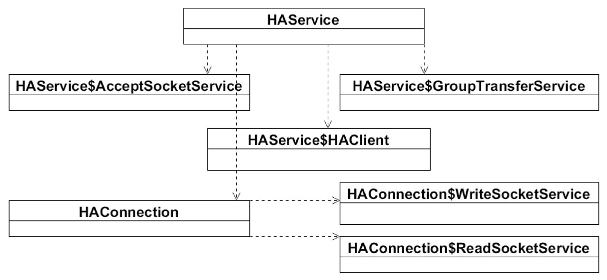
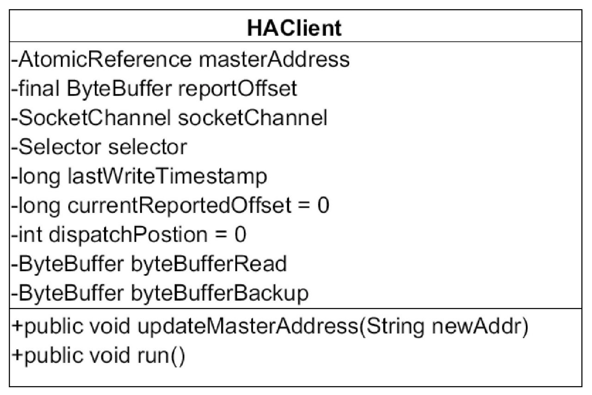
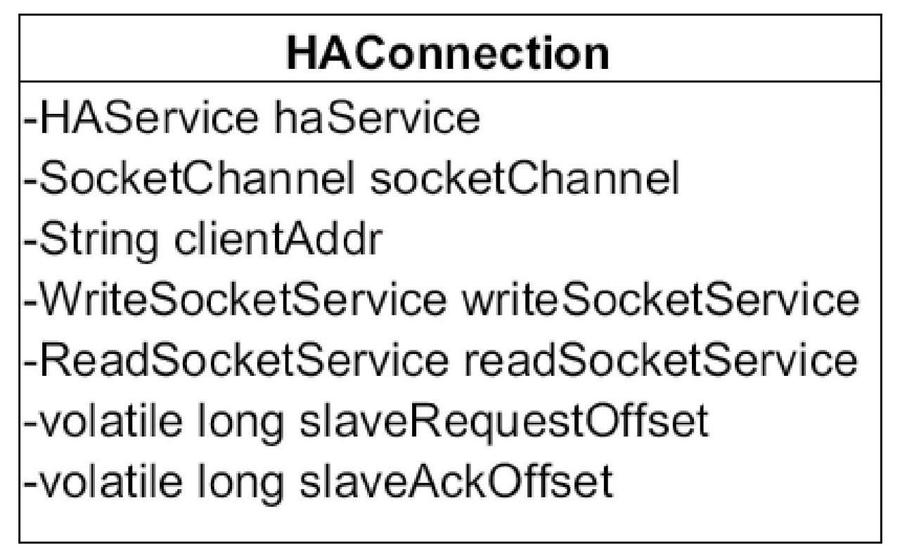
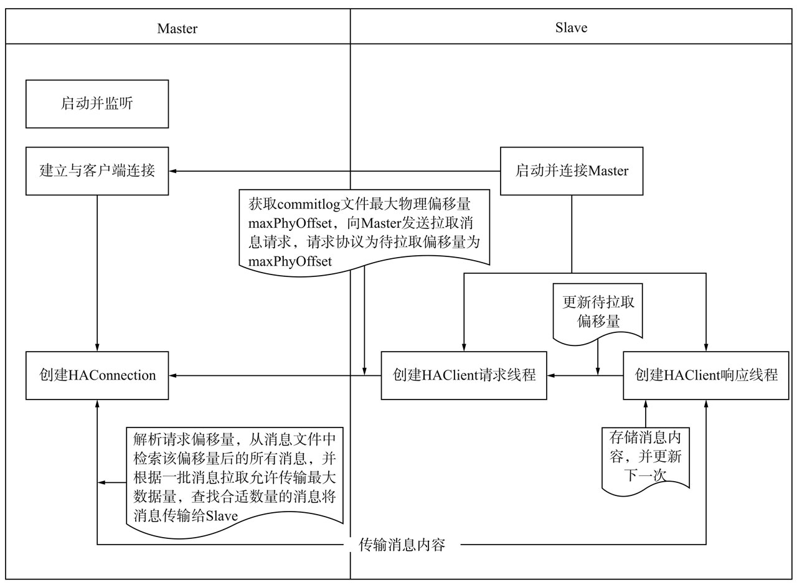
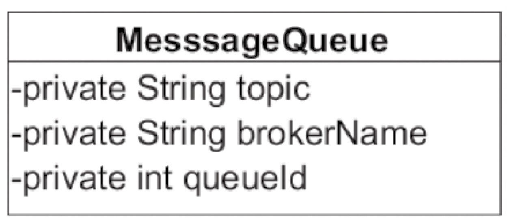

#RocketMQ主从同步(HA)机制

高可用特性是目前分布式系统中必备的特性之一，对一个中间件来说没有HA机制是一个重大的缺陷，本章将主要分析RocketMQ主从同步（HA）机制。

##7.1 RocketMQ主从复制原理

为了提高消息消费的高可用性，避免Broker发生单点故障引起存储在Broker上的消息无法及时消费，RocketMQ引入了Broker主备机制，即消息消费到达主服务器后需要将消息同步到消息从服务器，如果主服务器Broker宕机后，消息消费者可以从从服务器拉取消息。

接下来将详细探讨RocketMQ HA的实现原理，**RocketMQ HA核心实现类图**如图7-1所示。

从图7-1中我们知道RocketMQ HA由7个核心类实现，分别如下。
* 1）HAService:RocketMQ主从同步核心实现类。
* 2）HAService$AcceptSocketService:HA Master端监听客户端连接实现类。
* 3）HAService$GroupTransferService：主从同步通知实现类。
* 4）HAService$HAClient:HA Client端实现类。
* 5）HAConnection:HA Master服务端HA连接对象的封装，与Broker从服务器的网络读写实现类。
* 6）HAConnection$ReadSocketService:HA Master网络读实现类。
* 7）HAConnection$WriteSocketService:HA Master网络写实现类

###7.1.1 HAService整体工作机制

RocketMQ HA的实现原理如下。
* 1）主服务器启动，并在特定端口上监听从服务器的连接。
* 2）从服务器主动连接主服务器，主服务器接收客户端的连接，并建立相关TCP连接。
* 3）从服务器主动向主服务器发送待拉取消息偏移量，主服务器解析请求并返回消息给从服务器。
* 4）从服务器保存消息并继续发送新的消息同步请求

代码清单7-1 `HAService#start`

###7.1.2 AcceptSocketService实现原理

`HAService#AcceptSocketService`

###7.1.3 GroupTransferService实现原理

`HAService#GroupTransferService`

###7.1.4 HAClient实现原理

HAClient类图, 主要看`HAClient#run`源码注释

###7.1.5 HAConnection实现原理

Master服务器在收到从服务器的连接请求后，会将主从服务器的连接SocketChannel封装成HAConnection对象，实现主服务器与从服务器的读写操作。其类图如图7-4所示。

见源码注释，`HAConnection$ReadSocketService#processReadEvent`，`HAConnection$WriteSocketService#run`

**RocketMQ HA交互类图**

##7.2 RocketMQ读写分离机制

上节主要介绍了RocketMQ主从服务器的实现原理，本节主要介绍从服务器如何参与消息拉取负载机制。消息消费是基于消息消费队列MessageQueue，再回顾一下MessageQueue队列的类图，如图7-8所示。

接下来将重点分析RocketMQ根据brokerName查找Broker地址的过程。

RocketMQ根据MessageQueue查找Broker地址的唯一依据是brokerName，从Rocket-MQ的Broker组织结构中得知同一组Broker（M-S）服务器，它们的brokerName相同但brokerId不同，主服务器的brokerId为0，从服务器的brokerId大于0, 

RocketMQ提供`MQClientInstance#findBrokerAddressInSubscribe`来实现根据brokerName、brokerId查找Broker地址.

见其他源码注释 `PullAPIWrapper#recalculatePullFromWhichNode`，`PullAPIWrapper#processPullResult`，`DefaultMessageStore#getMessage`，`PullMessageProcessor#processRequest`

##7.3 本章小结

本章重点剖析了RocketMQ HA主从同步负载机制与主从服务器读写分离机制。

RocketMQ的HA机制，其核心实现是从服务器在启动的时候主动向主服务器建立TCP长连接，然后获取服务器的commitlog最大偏移量，以此偏移量向主服务器主动拉取消息，主服务器根据偏移量，与自身commitlog文件的最大偏移量进行比较，如果大于从服务器的commitlog偏移量，主服务器将向从服务器返回一定数量的消息，该过程循环进行，达到主从服务器数据同步。

RocketMQ读写分离与其他中间件的实现方式完全不同，RocketMQ是消费者首先向主服务器发起拉取消息请求，然后主服务器返回一批消息，然后会根据主服务器负载压力与主从同步情况，向从服务器建议下次消息拉取是从主服务器还是从从服务器拉取。