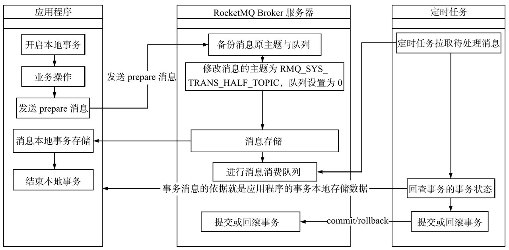
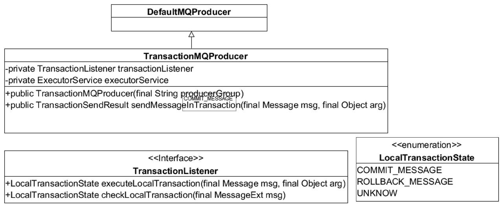
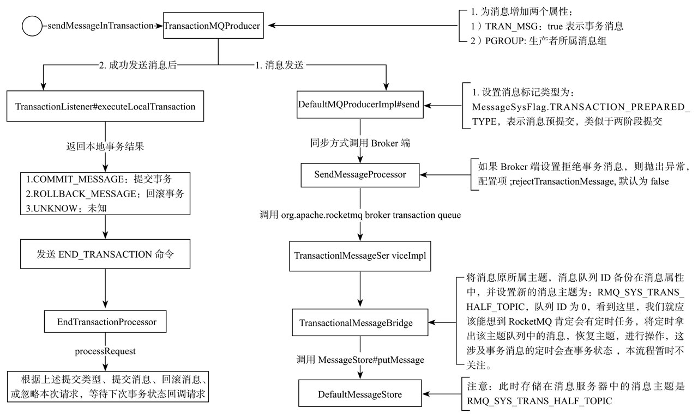
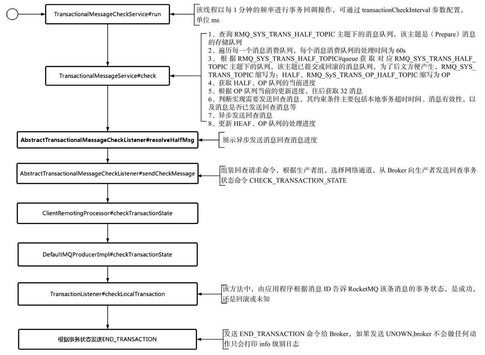

#RocketMQ事务消息

最近RocketMQ官方发布了4.3.0版本，此版本解决了RocketMQ对事务的支持，这一重大更新对RocketMQ至关重要。本章将基于RocketMQ官方最新4.3.0版本，对其事务消息的实现原理进行深入探讨。主要内容如下。

##8.1 事务消息实现思想

RocketMQ事务消息的实现原理基于两阶段提交和定时事务状态回查来决定消息最终是提交还是回滚，交互设计如图8-1所示

**RocketMQ事务消息实现原理**

*  1）应用程序在事务内完成相关业务数据落库后，需要同步调用RocketMQ消息发送接口，发送状态为prepare的消息。消息发送成功后，RocketMQ服务器会回调RocketMQ消息发送者的事件监听程序，记录消息的本地事务状态，该相关标记与本地业务操作同属一个事务，确保消息发送与本地事务的原子性。
*  2）RocketMQ在收到类型为prepare的消息时，会首先备份消息的原主题与原消息消费队列，然后将消息存储在主题为`RMQ_SYS_TRANS_HALF_TOPIC`的消息消费队列中。
*  3）RocketMQ消息服务器开启一个定时任务，消费`RMQ_SYS_TRANS_HALF_TOPIC`的消息，向消息发送端（应用程序）发起消息事务状态回查，应用程序根据保存的事务状态回馈消息服务器事务的状态（提交、回滚、未知），如果是提交或回滚，则消息服务器提交或回滚消息，如果是未知，待下一次回查，RocketMQ允许设置一条消息的回查间隔与回查次数，如果在超过回查次数后依然无法获知消息的事务状态，则默认回滚消息。

##8.2 事务消息发送流程

RocketMQ事务消息发送者为`org.apache.rocketmq.client.producer.TransactionMQProducer`。其类继承图如图8-2所示。

见源码注释 `TransactionMQProducer#sendMessageInTransaction`,`DefaultMQProducerImpl#sendMessageInTransaction`, prepare消息发送 `DefaultMQProducerImpl#sendKernelImpl`，`SendMessageProcessor#asyncSendMessage
`，`TransactionalMessageBridge#asyncPutHalfMessage`, `DefaultMQProducerImpl#endTransaction`

**TransactionMQProducer事务发送流程**

##8.3 提交或回滚事务

本节继续探讨两阶段提交的第二个阶段：提交或回滚事务。

代码清单8-8 `DefaultMQProducerImpl#endTransaction`

##8.4 事务消息回查事务状态

上节重点梳理了RocketMQ基于两阶段协议发送与提交回滚消息，本节将深入学习事务状态消息回查，事务消息存储在消息服务器时主题被替换为RMQ_SYS_TRANS_HALF_TOPIC，执行完本地事务返回本地事务状态为UN_KNOW时，结束事务时将不做任何处理，而是通过事务状态定时回查以期得到发送端明确的事务操作（提交事务或回滚事务）。

RocketMQ通过TransactionalMessageCheckService线程定时去检测RMQ_SYS_TRANS_HALF_TOPIC主题中的消息，回查消息的事务状态。TransactionalMessage Check Service的检测频率默认为1分钟，可通过在broker.conf文件中设置transactionCheck Interval来改变默认值，单位为毫秒。

代码清单8-10 `TransactionalMessageCheckService#onWaitEnd`

源码注释 `TransactionalMessageServiceImpl#check`

**事务状态回查流程图**

##8.5 本章小结

本章重点分析了RocketMQ事务消息的实现机制，一言以蔽之，RocketMQ事务消息基于两阶段提交和事务状态回查机制来实现，

所谓的两阶段提交，即首先发送prepare消息，待事务提交或回滚时发送commit、rollback命令。再结合定时任务，RocketMQ使用专门的线程以特定的频率对RocketMQ服务器上的prepare信息进行处理，向发送端查询事务消息的状态来决定是否提交或回滚消息。