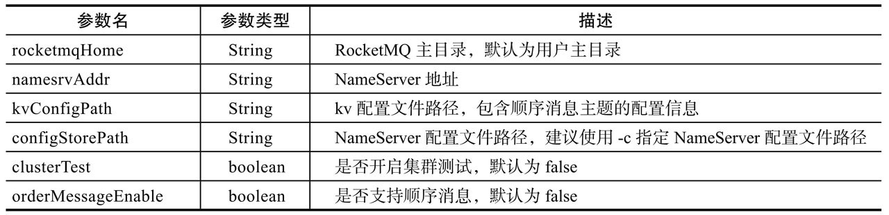
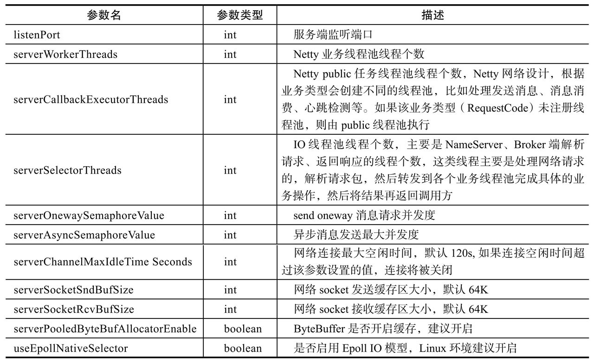
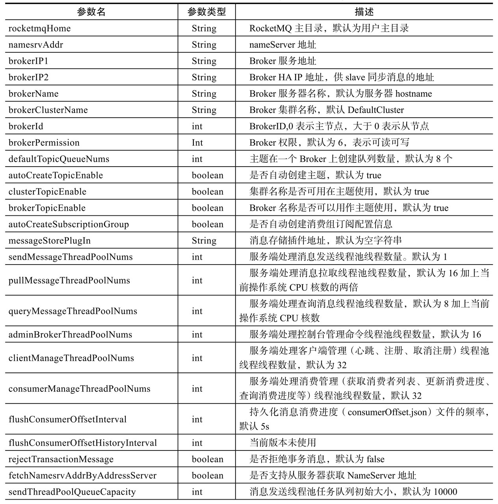
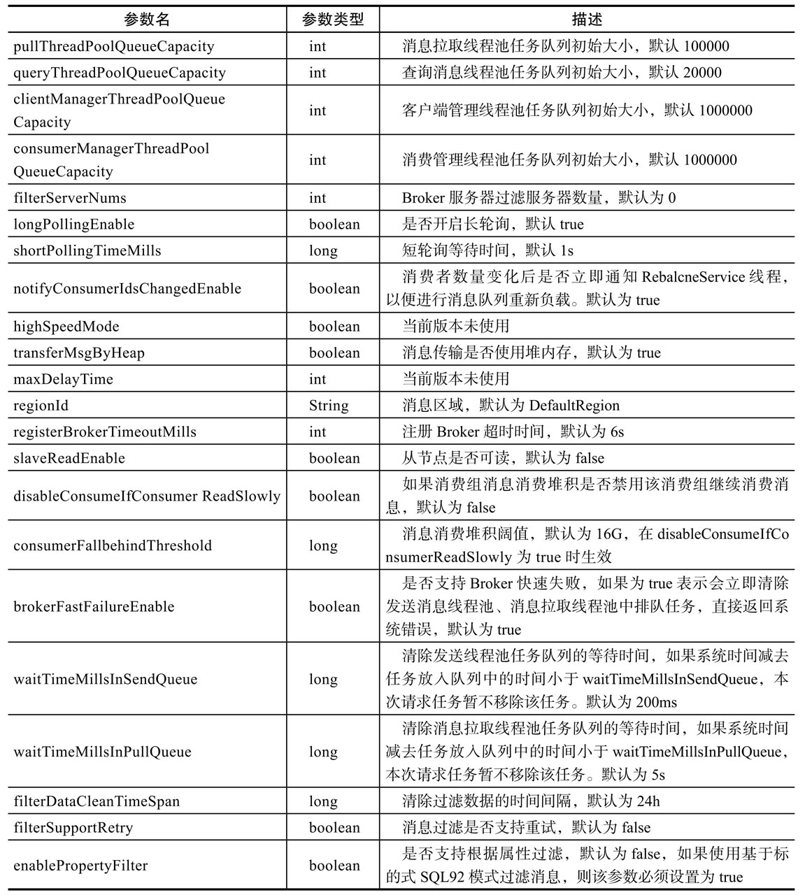
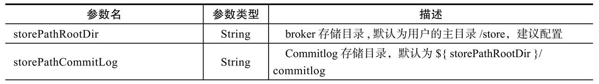
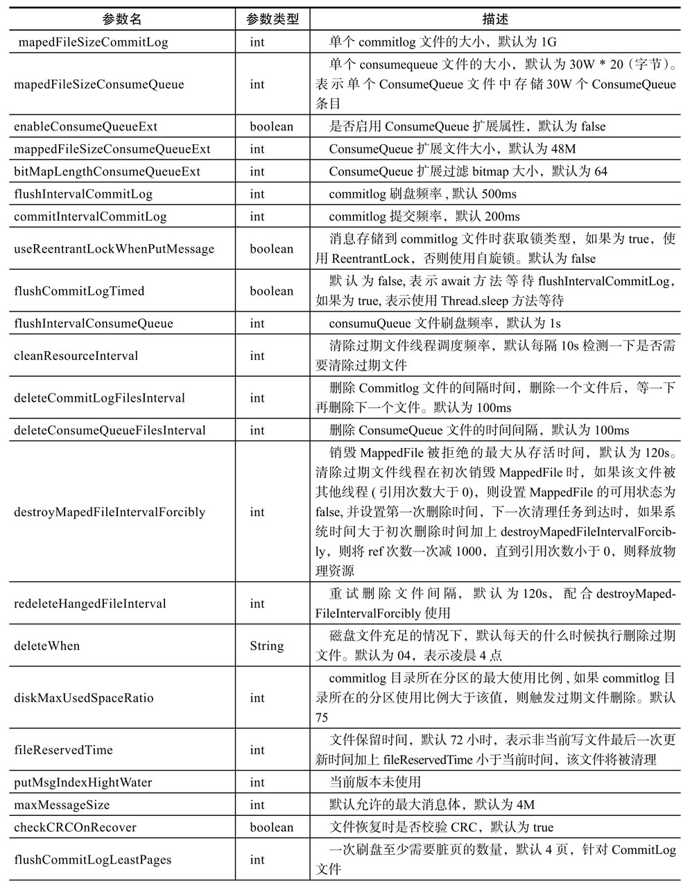
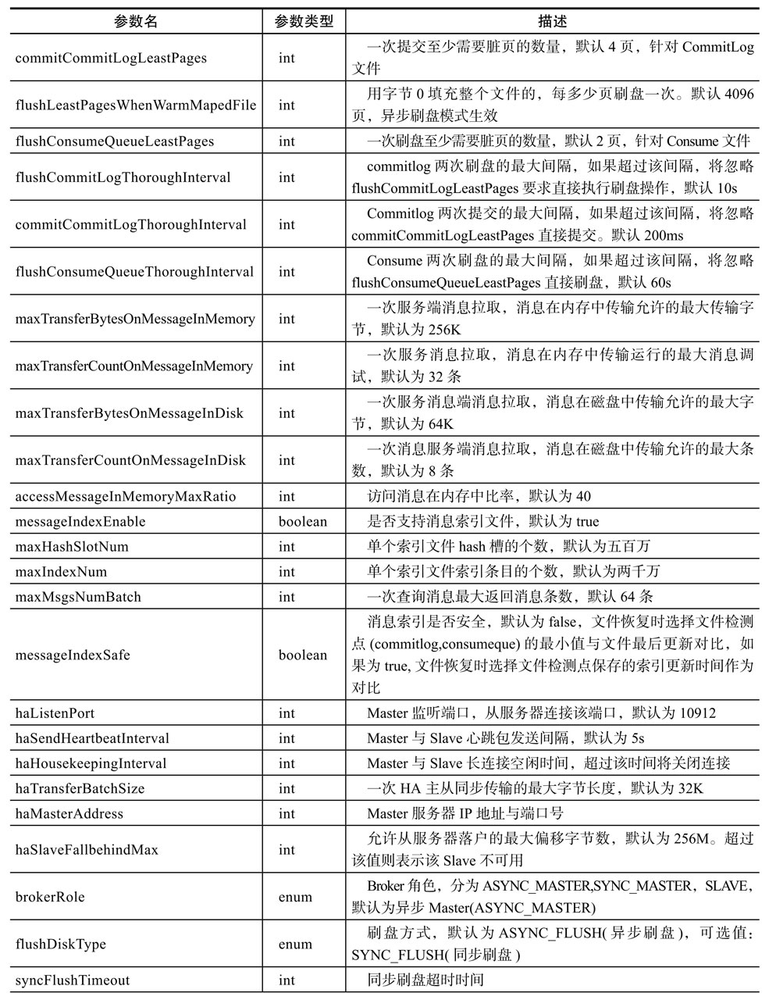
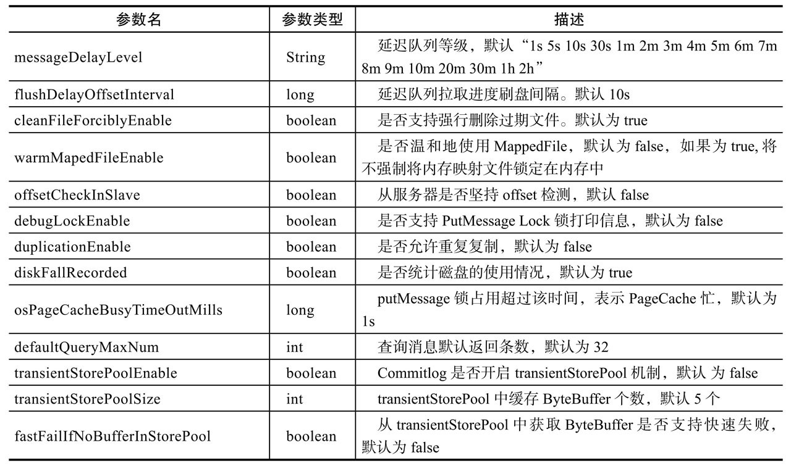
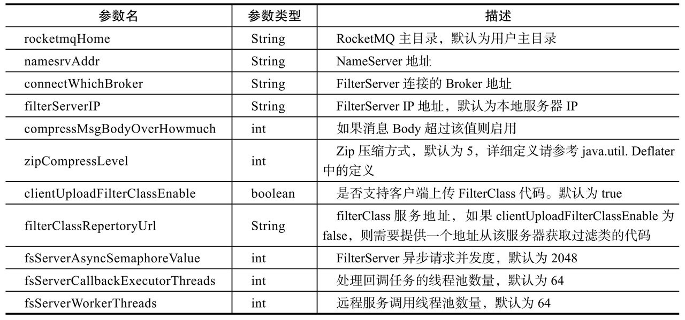

#RocketMQ实战

##9.1 事务消息

我们以一个订单流转流程来举例，例如订单子系统创建订单，需要将订单数据下发到其他子系统（与第三方系统对接）这个场景。我们通常会将两个系统进行解耦，不直接使用服务调用的方式进行交互。其业务实现步骤通常有下面几步。
* 1）A系统创建订单并入库。
* 2）发送消息到MQ。
* 3）MQ消费者消费消息，发送远程RPC服务调用，完成订单数据的同步。

**方案一：**
```java
public Map createOrder(){
Map result=new HashMap();
// 执行下订单相关的业务流程，例如操作本地数据库落库相关代码   
// 调用消息发送端API发送消息   
// 返回结果，提交事务    
// return result;
}
```

方案一有以下弊端。
* 1）如果消息发送成功，在提交事务的时候JVM突然挂掉，事务没有成功提交，导致两个系统之间数据不一致。
* 2）由于消息是在事务提交之前提交，发送的消息内容是订单实体的内容，会造成在消费端进行消费时如果需要验证订单是否存在时可能出现订单不存在的情况。
* 3）消息发送可以考虑异步发送

**方案二：**

由于存在上述问题，在MQ不支持事务消息的前提条件下，可以采用下面的方式进行优化。

```java
public Map createOrder() {
    Map result = new HashMap();    
// 执行下订单相关的业务流程，例如操作本地数据库落库相关代码    
// 生成事务消息唯一业务表示，将该业务表示组装到待发送的消息体中    
// 往待发送消息表中插入一条记录，本次唯一消息发送业务ID，消息JSON{消息主题、消息tag、消息体}、创建时间、发送状态   
// 将消息体返回到控制器层   
// 返回结果，提交事务
return result;
}
```
然后在控制器层异步发送消息，同时需要引入定时机制，去扫描待发送消息记录，避免消息丢失。

方案二有以下弊端。
* 1）消息有可能重复发送，但在消费端可以通过唯一业务编号来进行去重设计。
* 2）实现过于复杂，为了避免极端情况下的消息丢失，需要使用定时任务。


**方案三：基于RocketMQ4.3版本事务消息。**

```java
public Map createOrder(){
    Map result=new HashMap();
    // 执行下订单相关的业务流程，例如操作本地数据库落库相关代码
    // 生成事务消息唯一业务表示，将该业务表示组装到待发送的消息体中，方便消息消费端进行幂等消费。
    // 调用消息客户端API，发送事务prepare消息消费。
    // 返回结果，提交事务
   return result;
}
```
上述是第一步，发送事务消息，接下来需要实现TransactionListener，实现执行本地事务与本地事务回查。

**代码清单9-14 TransactionListener监听器实现伪代码：**

```java
public class OrderTransactionListenerImpl implements TransactionListener {

    private ConcurrentHashMap<String, Integer> countHashMap = new ConcurrentHashMap<>();
    private final static int MAX_COUNT = 5;

    @Override
    public LocalTransactionState executeLocalTransaction(Message msg, Object arg) {
        String bizUniNo = msg.getUserProperty("bizUniNo");
        // 从消息中获取业务唯一ID。          
        // 将bizUniNo入库，表名：t_message_transaction，表结构bizUniNo(主键)，业务类型。
        return LocalTransactionState.UNKNOW;
    }

    @Override
    public LocalTransactionState checkLocalTransaction(MessageExt msg) {
        Integer status = 0;
        // 从数据库查询t_message_transaction表，如果该表中存在记录，则提交，           
        String bizUniNo = msg.getUserProperty("bizUniNo");
        // 从消息中获取业务唯一ID。              
        //  然后查询t_message_transaction 表，是否存在bizUniNo，如果存在，则返回COMMIT_MESSAGE，            
        // 不存在，则记录查询次数，未超过次数，返回UNKNOW，超过次数，返回ROLLBACK_MESSAGE            
        if (query(bizUniNo) > 0) {
            return LocalTransactionState.ROLLBACK_MESSAGE;
        }
        return rollBackOrUnown(bizUniNo);
    }

    public int query(String bizUniNo) {
        return 1;
        //select count(1) from t_message_transaction a where
        //a.biz_uni_no=#{bizUniNo}        
    }

    public LocalTransactionState rollBackOrUnown(String bizUniNo) {
        Integer num = countHashMap.get(bizUniNo);
        if (num != null && ++num > MAX_COUNT) {
            countHashMap.remove(bizUniNo);
            return LocalTransactionState.ROLLBACK_MESSAGE;
        }
        if (num == null) {
            num = new Integer(1);
        }
        countHashMap.put(bizUniNo, num);
        return LocalTransactionState.UNKNOW;
    }
}
```
**实现要点如下：**
* executeLocalTransaction：该方法主要是设置本地事务状态，与业务方代码在一个事务中，例如OrderServer#createMap中，只要本地事务提交成功，该方法也会提交成功。故在这里，主要是向t_message_transaction添加一条记录，在事务回查时，如果存在记录，就认为是该消息需要提交，其返回值建议返还LocalTransactionState. UNKNOW。
* checkLocalTransaction：该方法主要是告知RocketMQ消息是需要提交还是回滚，如果本地事务表（t_message_transaction）存在记录，则认为提交；如果不存在，可以设置回查次数，如果指定次数内还是未查到消息，则回滚，否则返回未知。rocketmq会按一定的频率回查事务，当然回查次数也有限制，默认为5次，可配置。


##9.2 参数说明


**表A-1 NameServer配置属性**




**表A-2 NameServer、Broker网络配置属性**




**表A-3 Broker配置属性(服务器属性)**






**表A-4 Broker配置属性（存储相关属性）**










**表A-5 FilterServer配置属性**

