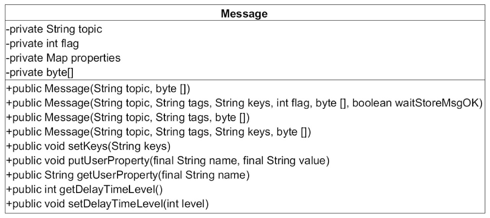
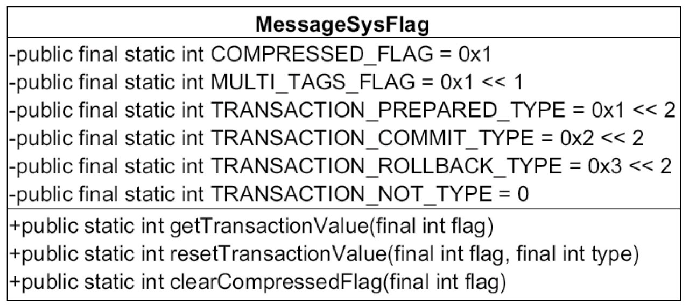
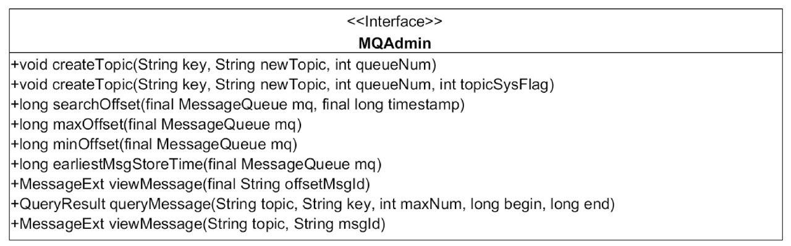
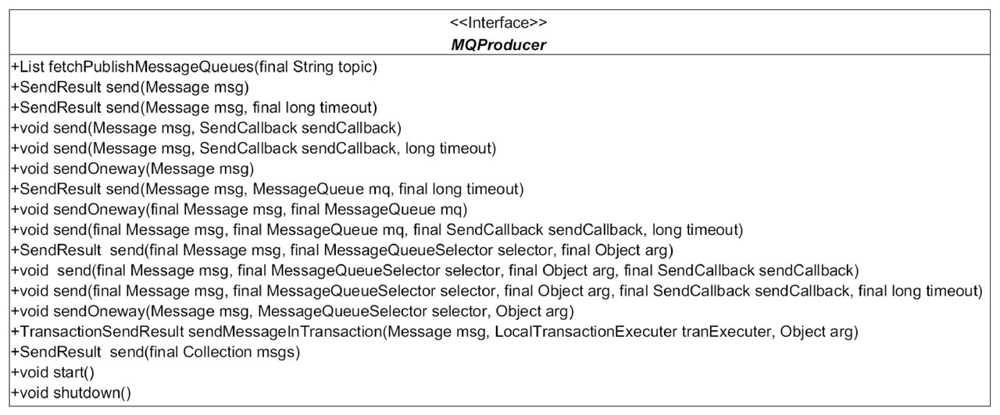
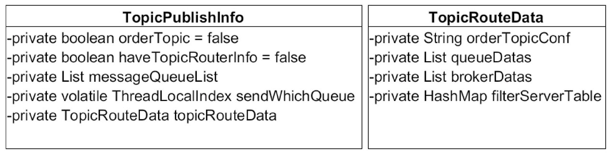
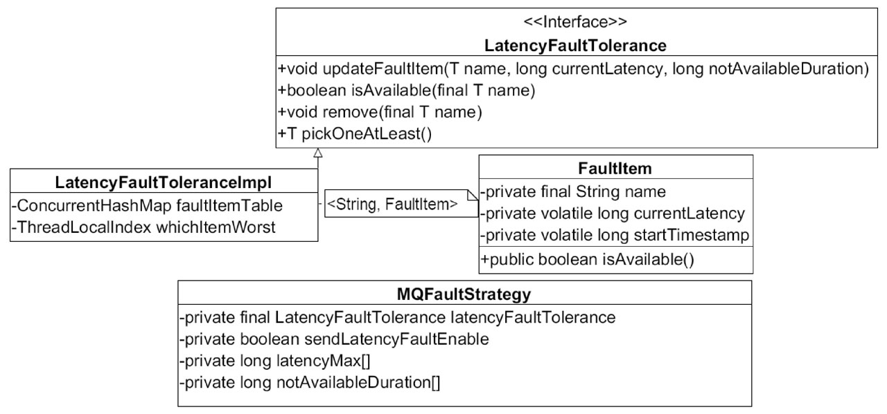
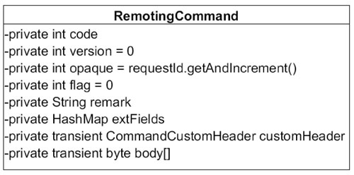
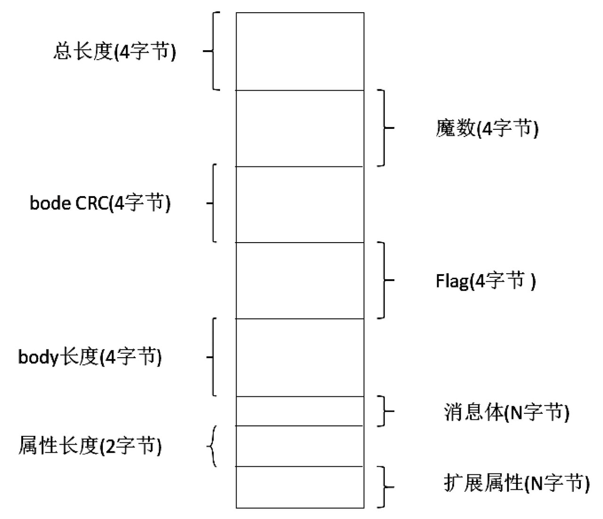

#RocketMQ消息发送

RocketMQ发送普通消息有三种实现方式：**可靠同步发送**、**可靠异步发送**、**单向（Oneway）发送**。
第3章主要聚焦在RocketMQ如何发送消息，然后从消息的数据结构开始，逐步介绍生产者的启动流程和消息发送的流程，最后再详细阐述批量消息发送

##3.1 漫谈RocketMQ消息发送

RocketMQ支持3种消息发送方式：同步（sync）、异步（async）、单向（oneway）。
*  同步：发送者向MQ执行发送消息API时，同步等待，直到消息服务器返回发送结果。
*  异步：发送者向MQ执行发送消息API时，指定消息发送成功后的回掉函数，然后调用消息发送API后，立即返回，消息发送者线程不阻塞，直到运行结束，消息发送成功或失败的回调任务在一个新的线程中执行。
*  单向：消息发送者向MQ执行发送消息API时，直接返回，不等待消息服务器的结果，也不注册回调函数，简单地说，就是只管发，不在乎消息是否成功存储在消息服务器上

**RocketMQ消息发送需要考虑以下几个问题。**
*  消息队列如何进行负载？
*  消息发送如何实现高可用？
*  批量消息发送如何实现一致性？

##3.2 认识RocketMQ消息

RocketMQ消息封装类是`org.apache.rocketmq.common.message.Message`。Message类设计如图3-1所示



Message的基础属性主要包括消息所属主题topic、消息Flag（RocketMQ不做处理）、扩展属性、消息体。

RocketMQ定义的MessageFlag如图3-2所示


**代码清单3-1 Message全属性构造函数:**
```java
public Message(String topic, String tags, String keys, int flag, byte[] body, boolean waitStoreMsgOK) {
this.topic = topic;
this.flag = flag;
this.body = body;

if (tags != null && tags.length() > 0) {
    this.setTags(tags);
}

if (keys != null && keys.length() > 0) {
    this.setKeys(keys);
}

this.setWaitStoreMsgOK(waitStoreMsgOK);
}
```
**Message扩展属性主要包含下面几个。这些扩展属性存储在Message的properties中**

*  tag：消息TAG，用于消息过滤。
*  keys: Message索引键，多个用空格隔开，RocketMQ可以根据这些key快速检索到消息。
*  waitStoreMsgOK：消息发送时是否等消息存储完成后再返回。
*  delayTimeLevel：消息延迟级别，用于定时消息或消息重试。

##3.3 生产者启动流程

消息生产者的代码都在client模块中，相对于RocketMQ来说，它就是客户端，也是消息的提供者，我们在应用系统中初始化生产者的一个实例即可使用它来发消息。

###3.3.1 初识DefaultMQProducer消息发送者

`DefaultMQProducer`是默认的消息生产者实现类，它实现MQAdmin的接口，其主要接口一览如图3-3和图3-4所示。




**下面介绍DefaultMQProducer的主要方法。**
*  1）void createTopic（String key, String newTopic, int queueNum, int topicSysFlag）
创建主题。
   *  key：目前未实际作用，可以与newTopic相同。
   *  newTopic：主题名称。
   *  queueNum：队列数量。
   *  topicSysFlag：主题系统标签，默认为0。
*  2）long searchOffset（final MessageQueue mq, final long timestamp）
根据时间戳从队列中查找其偏移量。
*  3）long maxOffset（final MessageQueue mq）
查找该消息队列中最大的物理偏移量。
*  4）long minOffset（final MessageQueue mq）
查找该消息队列中最小物理偏移量。
*  5）MessageExt viewMessage（final String offsetMsgId）
根据消息偏移量查找消息。
*  6）QueryResult queryMessage（final String topic, final String key, final int maxNum, final long begin, final long end）
根据条件查询消息。
   *  topic：消息主题
   *  key：消息索引字段。
   *  maxNum：本次最多取出消息条数。
   *  begin：开始时间。
   *  end：结束时间
*  7）MessageExt viewMessage（String topic, String msgId）
根据主题与消息ID查找消息。
*  8）List<MessageQueue> fetchPublishMessageQueues（final String topic）
查找该主题下所有的消息队列。
*  9）SendResult send（final Message msg）
同步发送消息，具体发送到主题中的哪个消息队列由负载算法决定。
*  10）SendResult send（final Message msg, final long timeout）
同步发送消息，如果发送超过timeout则抛出超时异常。
*  11）void send（final Message msg, final SendCallback sendCallback）
异步发送消息，sendCallback参数是消息发送成功后的回调方法。
*  12）void send（final Message msg, final SendCallback sendCallback, final long timeout）
异步发送消息，如果发送超过timeout指定的值，则抛出超时异常。
*  13）void sendOneway（final Message msg）
单向消息发送，就是不在乎发送结果，消息发送出去后该方法立即返回。
*  14）SendResult send（final Message msg, final MessageQueue mq）
同步方式发送消息，发送到指定消息队列。
*  15）void send（final Message msg, final MessageQueue mq, final SendCallback sendCallback）
异步方式发送消息，发送到指定消息队列
*  16）void sendOneway（final Message msg, final MessageQueue mq）
   单向方式发送消息，发送到指定的消息队列。
*  17）SendResult send（final Message msg, final MessageQueueSelector selector, final Object arg）
   消息发送，指定消息选择算法，覆盖消息生产者默认的消息队列负载。
*  18）SendResult send（final Collection<Message> msgs, final MessageQueue mq, final long timeout）
   同步批量消息发送

**代码清单3-2 DefaultMQProducer核心属性**

```java
private String producerGroup;
private String createTopicKey = TopicValidator.AUTO_CREATE_TOPIC_KEY_TOPIC;
private volatile int defaultTopicQueueNums = 4;
private int sendMsgTimeout = 3000;
private int compressMsgBodyOverHowmuch = 1024 * 4;
private int retryTimesWhenSendFailed = 2;
private int retryTimesWhenSendAsyncFailed = 2;
private boolean retryAnotherBrokerWhenNotStoreOK = false;
private int maxMessageSize = 1024 * 1024 * 4; // 4M
```
* producerGroup：生产者所属组，消息服务器在回查事务状态时会随机选择该组中任何一个生产者发起事务回查请求。
* createTopicKey：默认topicKey。
* defaultTopicQueueNums：默认主题在每一个Broker队列数量。
* sendMsgTimeout：发送消息默认超时时间，默认3s。
* compressMsgBodyOverHowmuch：消息体超过该值则启用压缩，默认4K。
* retryTimesWhenSendFailed：同步方式发送消息重试次数，默认为2，总共执行3次。
* retryTimesWhenSendAsyncFailed：异步方式发送消息重试次数，默认为2。
* retryAnotherBrokerWhenNotStoreOK：消息重试时选择另外一个Broker时，是否不等待存储结果就返回，默认为false。
* maxMessageSize：允许发送的最大消息长度，默认为4M，该值最大值为2^32-1。

###3.3.2 消息生产者启动流程

消息生产者是如何一步一步启动的呢？我们可以从这个类的`DefaultMQProducerImpl`的start方法来跟踪，具体细节如下。

**代码清单3-3 DefaultMQProducerImpl#start**

```java
if (!this.defaultMQProducer.getProducerGroup().equals(MixAll.CLIENT_INNER_PRODUCER_GROUP)) {
    this.defaultMQProducer.changeInstanceNameToPID();
}
```
Step1：检查productGroup是否符合要求；并改变生产者的instanceName为进程ID

```java
this.mQClientFactory = MQClientManager.getInstance().getOrCreateMQClientInstance(this.defaultMQProducer, rpcHook);
```

**代码清单3-5 MQClientManager#getAndCreateMQClientInstance**

```java
public MQClientInstance getOrCreateMQClientInstance(final ClientConfig clientConfig, RPCHook rpcHook) {
    // clientId为客户端IP+instance+（unitname可选），如果在同一台物理服务器部署两个应用程序，应用程序岂不是clientId相同，会造成混乱
    String clientId = clientConfig.buildMQClientId();
    MQClientInstance instance = this.factoryTable.get(clientId);
    if (null == instance) {
        instance =
            new MQClientInstance(clientConfig.cloneClientConfig(),
                this.factoryIndexGenerator.getAndIncrement(), clientId, rpcHook);
        MQClientInstance prev = this.factoryTable.putIfAbsent(clientId, instance);
        if (prev != null) {
            instance = prev;
            log.warn("Returned Previous MQClientInstance for clientId:[{}]", clientId);
        } else {
            log.info("Created new MQClientInstance for clientId:[{}]", clientId);
        }
    }

    return instance;
}
```
Step2：创建MQClientInstance实例。整个JVM实例中只存在一个MQClientManager实例，维护一个MQClientInstance缓存表ConcurrentMap<String/* clientId */, MQClientInstance>factoryTable =new ConcurrentHashMap<String, MQClientInstance>（），也就是同一个clientId只会创建一个MQClientInstance。代码清单3-6是创建clientId的方法

**代码清单3-6 ClientConfig#buildMQClientId**

```java
public String buildMQClientId() {
    StringBuilder sb = new StringBuilder();
    sb.append(this.getClientIP());

    sb.append("@");
    sb.append(this.getInstanceName());
    if (!UtilAll.isBlank(this.unitName)) {
        sb.append("@");
        sb.append(this.unitName);
    }

    return sb.toString();
}
```
clientId为客户端IP+instance+（unitname可选），如果在同一台物理服务器部署两个应用程序，应用程序岂不是clientId相同，会造成混乱？

```xml
为了避免这个问题，如果instance为默认值DEFAULT的话，RocketMQ会自动将instance设置为进程ID，
这样避免了不同进程的相互影响，但同一个JVM中的不同消费者和不同生产者在启动时获取到的MQClientInstane实例都是同一个。
根据后面的介绍，MQClientInstance封装了RocketMQ网络处理API，是消息生产者（Producer）、消息消费者（Consumer）与NameServer、Broker打交道的网络通道
```
**代码清单3-7 DefaultMQProducerImpl#start**

```java
boolean registerOK = mQClientFactory.registerProducer(this.defaultMQProducer.getProducerGroup(), this);
if (!registerOK) {
    this.serviceState = ServiceState.CREATE_JUST;
    throw new MQClientException("The producer group[" + this.defaultMQProducer.getProducerGroup()
        + "] has been created before, specify another name please." + FAQUrl.suggestTodo(FAQUrl.GROUP_NAME_DUPLICATE_URL),
        null);
}
this.topicPublishInfoTable.put(this.defaultMQProducer.getCreateTopicKey(), new TopicPublishInfo());

if (startFactory) {
// 启动MQClientInstance，如果MQClientInstance已经启动，则本次启动不会真正执行
mQClientFactory.start();
}
```
Step3：向MQClientInstance注册，将当前生产者加入到MQClientInstance管理中，方便后续调用网络请求、进行心跳检测等。

Step4：启动MQClientInstance，如果MQClientInstance已经启动，则本次启动不会真正执行。MQClientInstance启动过程将在第5章讲解消息消费时有详细的介绍

##3.4 消息发送基本流程

消息发送流程主要的步骤：验证消息、查找路由、消息发送（包含异常处理机制）

**代码清单3-8 同步消息发送入口`DefaultMQProducer#send`**

```java
public SendResult send(
    Message msg) throws MQClientException, RemotingException, MQBrokerException, InterruptedException {
    msg.setTopic(withNamespace(msg.getTopic()));
    return this.defaultMQProducerImpl.send(msg);
}
DefaultMQProducerImpl#send
public SendResult send(
Message msg) throws MQClientException, RemotingException, MQBrokerException, InterruptedException {
return send(msg, this.defaultMQProducer.getSendMsgTimeout());
}
public SendResult send(Message msg,
long timeout) throws MQClientException, RemotingException, MQBrokerException, InterruptedException {
return this.sendDefaultImpl(msg, CommunicationMode.SYNC, null, timeout);
}
```
默认消息发送以同步方式发送，默认超时时间为3s。

本节主要以`SendResult sendDefaultImpl（Messsage message）`方法为突破口，窥探一下消息发送的基本实现流程

###3.4.1 消息长度验证
消息发送之前，首先确保生产者处于运行状态，然后验证消息是否符合相应的规范，具体的规范要求是主题名称、消息体不能为空、消息长度不能等于0且默认不能超过允许发送消息的最大长度4M（maxMessageSize=1024 * 1024 * 4）。

###3.4.2 查找主题路由信息
消息发送之前，首先需要获取主题的路由信息，只有获取了这些信息我们才知道消息要发送到具体的Broker节点

**代码清单3-9 DefaultMQProducerImpl#tryToFindTopicPublishInfo**

```java
private TopicPublishInfo tryToFindTopicPublishInfo(final String topic) {
TopicPublishInfo topicPublishInfo = this.topicPublishInfoTable.get(topic);
if (null == topicPublishInfo || !topicPublishInfo.ok()) {
    this.topicPublishInfoTable.putIfAbsent(topic, new TopicPublishInfo());
    // 功能是消息生产者更新和维护路由缓存
    this.mQClientFactory.updateTopicRouteInfoFromNameServer(topic);
    topicPublishInfo = this.topicPublishInfoTable.get(topic);
}

if (topicPublishInfo.isHaveTopicRouterInfo() || topicPublishInfo.ok()) {
    return topicPublishInfo;
} else {
    this.mQClientFactory.updateTopicRouteInfoFromNameServer(topic, true, this.defaultMQProducer);
    topicPublishInfo = this.topicPublishInfoTable.get(topic);
    return topicPublishInfo;
}
}
```
tryToFindTopicPublishInfo是查找主题的路由信息的方法。如果生产者中缓存了topic的路由信息，如果该路由信息中包含了消息队列，则直接返回该路由信息，如果没有缓存或没有包含消息队列，则向NameServer查询该topic的路由信息。如果最终未找到路由信息，则抛出异常：无法找到主题相关路由信息异常。

先看一下TopicPublishInfo，如图3-5所示



下面我们来一一介绍下TopicPublishInfo的属性。

* orderTopic：是否是顺序消息。
* List<MessageQueue> messageQueueList：该主题队列的消息队列。
* sendWhichQueue：每选择一次消息队列，该值会自增1，如果Integer.MAX_VALUE，则重置为0，用于选择消息队列。
* List<QueueData> queueData:topic队列元数据。
* List<BrokerData> brokerDatas:topic分布的broker元数据。
* HashMap<String/* brokerAdress*/, List<String> /*filterServer*/>:broker上过滤服务器地址列表。

第一次发送消息时，本地没有缓存topic的路由信息，查询NameServer尝试获取，如果路由信息未找到，再次尝试用默认主题DefaultMQProducerImpl#createTopicKey去查询，如果BrokerConfig#autoCreateTopicEnable为true时，NameServer将返回路由信息，如果autoCreateTopicEnable为false将抛出无法找到topic路由异常。

代码MQClientInstance#updateTopicRouteInfoFromNameServer这个方法的功能是消息生产者更新和维护路由缓存，具体代码如下。

```java
TopicRouteData topicRouteData;
if (isDefault && defaultMQProducer != null) {
    topicRouteData = this.mQClientAPIImpl.getDefaultTopicRouteInfoFromNameServer(defaultMQProducer.getCreateTopicKey(),
        clientConfig.getMqClientApiTimeout());
    if (topicRouteData != null) {
        for (QueueData data : topicRouteData.getQueueDatas()) {
            int queueNums = Math.min(defaultMQProducer.getDefaultTopicQueueNums(), data.getReadQueueNums());
            data.setReadQueueNums(queueNums);
            data.setWriteQueueNums(queueNums);
        }
    }
} else {
    topicRouteData = this.mQClientAPIImpl.getTopicRouteInfoFromNameServer(topic, clientConfig.getMqClientApiTimeout());
}
```
Step1：如果isDefault为true，则使用默认主题去查询，如果查询到路由信息，则替换路由信息中读写队列个数为消息生产者默认的队列个数（defaultTopicQueueNums）；如果isDefault为false，则使用参数topic去查询；如果未查询到路由信息，则返回false，表示路由信息未变化.

```java
TopicRouteData old = this.topicRouteTable.get(topic);
boolean changed = topicRouteDataIsChange(old, topicRouteData);
if (!changed) {
    changed = this.isNeedUpdateTopicRouteInfo(topic);
} else {
    log.info("the topic[{}] route info changed, old[{}] ,new[{}]", topic, old, topicRouteData);
}
```
Step2：如果路由信息找到，与本地缓存中的路由信息进行对比，判断路由信息是否发生了改变，如果未发生变化，则直接返回false。

Step3：更新MQClientInstance Broker地址缓存表

```java
// Update Pub info
if (!producerTable.isEmpty()) {
    // 根据topicRouteData中的List<QueueData>转换成topicPublishInfo的List<MessageQueue>列表
    TopicPublishInfo publishInfo = topicRouteData2TopicPublishInfo(topic, topicRouteData);
    publishInfo.setHaveTopicRouterInfo(true);
    Iterator<Entry<String, MQProducerInner>> it = this.producerTable.entrySet().iterator();
    while (it.hasNext()) {
        Entry<String, MQProducerInner> entry = it.next();
        MQProducerInner impl = entry.getValue();
        if (impl != null) {
            impl.updateTopicPublishInfo(topic, publishInfo);
        }
    }
}
```
Step4：根据topicRouteData中的List<QueueData>转换成topicPublishInfo的List<MessageQueue>列表。其具体实现在topicRouteData2TopicPublishInfo，然后会更新该MQClientInstance所管辖的所有消息发送关于topic的路由信息.

```java
public static Set<MessageQueue> topicRouteData2TopicSubscribeInfo(final String topic, final TopicRouteData route) {
    Set<MessageQueue> mqList = new HashSet<MessageQueue>();
    List<QueueData> qds = route.getQueueDatas();
    for (QueueData qd : qds) {
        if (PermName.isReadable(qd.getPerm())) {
            for (int i = 0; i < qd.getReadQueueNums(); i++) {
                MessageQueue mq = new MessageQueue(topic, qd.getBrokerName(), i);
                mqList.add(mq);
            }
        }
    }

    return mqList;
}
```
循环遍历路由信息的QueueData信息，如果队列没有写权限，则继续遍历下一个QueueData；根据brokerName找到brokerData信息，找不到或没有找到Master节点，则遍历下一个QueueData；根据写队列个数，根据topic+序号创建MessageQueue，填充topicPublishInfo的List<QuueMessage>。完成消息发送的路由查找.

###3.4.3 选择消息队列

根据路由信息选择消息队列，返回的消息队列按照broker、序号排序。举例说明，如果topicA在broker-a, broker-b上分别创建了4个队列，那么返回的消息队列：[{“broker-Name”: ”broker-a”, ”queueId”:0}, {“brokerName”: ”broker-a”, ”queueId”:1},{“brokerName”:”broker-a”, ”queueId”:2}, {“brokerName”:”broker-a”, ”queueId”:3},{“brokerName”: ”broker-b”, ”queueId”:0}, {“brokerName”: ”broker-b”, ”queueId”:1}, {“brokerName”: ”broker-b”, ”queueId”:2}, {“brokerName”:”broker-b”, ”queueId”:3}]，那RocketMQ如何选择消息队列呢？

首先消息发送端采用重试机制，由retryTimesWhenSendFailed指定同步方式重试次数，异步重试机制在收到消息发送结构后执行回调之前进行重试。由retryTimes When SendAsyncFailed指定，接下来就是循环执行，选择消息队列、发送消息，发送成功则返回，收到异常则重试。选择消息队列有两种方式。
* 1）sendLatencyFaultEnable=false，默认不启用Broker故障延迟机制。
* 2）sendLatencyFaultEnable=true，启用Broker故障延迟机制。

####1．默认机制
sendLatencyFaultEnable=false，调用TopicPublishInfo#selectOneMessageQueue

```java
public MessageQueue selectOneMessageQueue(final String lastBrokerName) {
    if (lastBrokerName == null) {
        return selectOneMessageQueue();
    } else {
        for (int i = 0; i < this.messageQueueList.size(); i++) {
            int index = this.sendWhichQueue.incrementAndGet();
            int pos = Math.abs(index) % this.messageQueueList.size();
            if (pos < 0)
                pos = 0;
            MessageQueue mq = this.messageQueueList.get(pos);
            if (!mq.getBrokerName().equals(lastBrokerName)) {
                return mq;
            }
        }
        return selectOneMessageQueue();
    }
}
```
首先在一次消息发送过程中，可能会多次执行选择消息队列这个方法，lastBrokerName就是上一次选择的执行发送消息失败的Broker。第一次执行消息队列选择时，lastBrokerName为null，此时直接用sendWhichQueue自增再获取值，与当前路由表中消息队列个数取模，返回该位置的MessageQueue（selectOneMessageQueue（）方法），如果消息发送再失败的话，下次进行消息队列选择时规避上次MesageQueue所在的Broker，否则还是很有可能再次失败。

该算法在一次消息发送过程中能成功规避故障的Broker，但如果Broker宕机，由于路由算法中的消息队列是按Broker排序的，如果上一次根据路由算法选择的是宕机的Broker的第一个队列，那么随后的下次选择的是宕机Broker的第二个队列，消息发送很有可能会失败，再次引发重试，带来不必要的性能损耗，那么有什么方法在一次消息发送失败后，暂时将该Broker排除在消息队列选择范围外呢？或许有朋友会问，Broker不可用后，路由信息中为什么还会包含该Broker的路由信息呢？其实这不难解释：首先，NameServer检测Broker是否可用是有延迟的，最短为一次心跳检测间隔（10s）；其次，NameServer不会检测到Broker宕机后马上推送消息给消息生产者，而是消息生产者每隔30s更新一次路由信息，所以消息生产者最快感知Broker最新的路由信息也需要30s。如果能引入一种机制，在Broker宕机期间，如果一次消息发送失败后，可以将该Broker暂时排除在消息队列的选择范围中。

####2．Broker故障延迟机制

**代码清单3-15 MQFaultStrategy#selectOneMessageQueue**

```java
public MessageQueue selectOneMessageQueue(final TopicPublishInfo tpInfo, final String lastBrokerName) {
    // 默认不启用Broker故障延迟机制
    if (this.sendLatencyFaultEnable) {
        // 启用Broker故障延迟机制, 在Broker宕机期间，如果一次消息发送失败后，可以将该Broker暂时排除在消息队列的选择范围中。
        try {
            int index = tpInfo.getSendWhichQueue().incrementAndGet();
            for (int i = 0; i < tpInfo.getMessageQueueList().size(); i++) {
                int pos = Math.abs(index++) % tpInfo.getMessageQueueList().size();
                if (pos < 0)
                    pos = 0;
                MessageQueue mq = tpInfo.getMessageQueueList().get(pos);
                if (latencyFaultTolerance.isAvailable(mq.getBrokerName()))
                    return mq;
            }

            // 延迟机制接口
            final String notBestBroker = latencyFaultTolerance.pickOneAtLeast();
            int writeQueueNums = tpInfo.getQueueIdByBroker(notBestBroker);
            if (writeQueueNums > 0) {
                final MessageQueue mq = tpInfo.selectOneMessageQueue();
                if (notBestBroker != null) {
                    mq.setBrokerName(notBestBroker);
                    mq.setQueueId(tpInfo.getSendWhichQueue().incrementAndGet() % writeQueueNums);
                }
                return mq;
            } else {
                latencyFaultTolerance.remove(notBestBroker);
            }
        } catch (Exception e) {
            log.error("Error occurred when selecting message queue", e);
        }

        return tpInfo.selectOneMessageQueue();
    }

    return tpInfo.selectOneMessageQueue(lastBrokerName);
}
```
首先对上述代码进行解读。
* 1）根据对消息队列进行轮询获取一个消息队列。
* 2）验证该消息队列是否可用，latencyFaultTolerance.isAvailable（mq.getBrokerName（））是关键。
* 3）如果返回的MessageQueue可用，移除latencyFaultTolerance关于该topic条目，表明该Broker故障已经恢复

**Broker故障延迟机制核心类如图3-6所示**



LatencyFaultTolerance：延迟机制接口规范。
* 1）void updateFaultItem（final T name, final long currentLatency, final long notAvailable-Duration）
更新失败条目。
   * name:brokerName。
   * currentLatency：消息发送故障延迟时间。
   * notAvailableDuration：不可用持续时长，在这个时间内，Broker将被规避。
* 2）boolean isAvailable（final T name）
判断Broker是否可用。
   * name:broker名称。
* 3）void remove（final T name）
移除Fault条目，意味着Broker重新参与路由计算。
* 4）T pickOneAtLeast（）
尝试从规避的Broker中选择一个可用的Broker，如果没有找到，将返回null。
  
FaultItem：失败条目（规避规则条目）。
* 1）final String name条目唯一键，这里为brokerName。
* 2）private volatile long currentLatency本次消息发送延迟。
* 3）private volatile long startTimestamp故障规避开始时间

MQFaultStrategy：消息失败策略，延迟实现的门面类。
* 1）long[] latencyMax = {50L, 100L, 550L, 1000L, 2000L, 3000L, 15000L}，
* 2）long[] notAvailableDuration = {0L, 0L, 30000L, 60000L, 120000L, 180000L, 600000L}

latencyMax，根据currentLatency本次消息发送延迟，从latencyMax尾部向前找到第一个比currentLatency小的索引index，如果没有找到，返回0。然后根据这个索引从notAvailableDuration数组中取出对应的时间，在这个时长内，Broker将设置为不可用。

下面从源码的角度分析updateFaultItem、isAvailable方法的实现原理，如下所示。

**代码清单3-16 DefaultMQProducerImpl#sendDefaultImpl**
```java
beginTimestampPrev = System.currentTimeMillis();
if (times > 0) {
    //Reset topic with namespace during resend.
    msg.setTopic(this.defaultMQProducer.withNamespace(msg.getTopic()));
}
long costTime = beginTimestampPrev - beginTimestampFirst;
if (timeout < costTime) {
    callTimeout = true;
    break;
}
// 消息发送
sendResult = this.sendKernelImpl(msg, mq, communicationMode, sendCallback, topicPublishInfo, timeout - costTime);
endTimestamp = System.currentTimeMillis();
this.updateFaultItem(mq.getBrokerName(), endTimestamp - beginTimestampPrev, false);
```
上述代码如果发送过程中抛出了异常，调用DefaultMQProducerImpl#updateFaultItem，该方法则直接调用MQFaultStrategy#updateFaultItem方法，关注一下各个参数的含义

**代码清单3-17 MQFaultStrategy#updateFaultItem**

```java
public void updateFaultItem(final String brokerName, final long currentLatency, boolean isolation) {
    if (this.sendLatencyFaultEnable) {
        long duration = computeNotAvailableDuration(isolation ? 30000 : currentLatency);
        this.latencyFaultTolerance.updateFaultItem(brokerName, currentLatency, duration);
    }
}
```
如果isolation为true，则使用30s作为computeNotAvailableDuration方法的参数；如果isolation为false，则使用本次消息发送时延作为computeNotAvailableDuration方法的参数，那computeNotAvailableDuration的作用是计算因本次消息发送故障需要将Broker规避的时长，也就是接下来多久的时间内该Broker将不参与消息发送队列负载。具体算法：从latencyMax数组尾部开始寻找，找到第一个比currentLatency小的下标，然后从notAvailableDuration数组中获取需要规避的时长，该方法最终调用LatencyFaultTolerance的updateFaultItem。

```java
public void updateFaultItem(final String name, final long currentLatency, final long notAvailableDuration) {
    FaultItem old = this.faultItemTable.get(name);
    if (null == old) {
        final FaultItem faultItem = new FaultItem(name);
        faultItem.setCurrentLatency(currentLatency);
        faultItem.setStartTimestamp(System.currentTimeMillis() + notAvailableDuration);

        old = this.faultItemTable.putIfAbsent(name, faultItem);
        if (old != null) {
            old.setCurrentLatency(currentLatency);
            old.setStartTimestamp(System.currentTimeMillis() + notAvailableDuration);
        }
    } else {
        old.setCurrentLatency(currentLatency);
        old.setStartTimestamp(System.currentTimeMillis() + notAvailableDuration);
    }
}
```
根据broker名称从缓存表中获取FaultItem，如果找到则更新FaultItem，否则创建FaultItem。这里有两个关键点。
* 1）currentLatency、startTimeStamp被volatile修饰。
* 2）startTimeStamp为当前系统时间加上需要规避的时长。startTimeStamp是判断broker当前是否可用的直接一句，请看FaultItem#isAvailable方法。

##3.4.4 消息发送

消息发送API核心入口：`DefaultMQProducerImpl#sendKernelImpl`
```java
private SendResult sendKernelImpl(final Message msg,
        final MessageQueue mq,
        final CommunicationMode communicationMode,
        final SendCallback sendCallback,
        final TopicPublishInfo topicPublishInfo,
        final long timeout)
```
消息发送参数详解。
* 1）Message msg：待发送消息。
* 2）MessageQueue mq：消息将发送到该消息队列上。
* 3）CommunicationMode communicationMode：消息发送模式，SYNC、ASYNC、ONEWAY。
* 4）SendCallback sendCallback：异步消息回调函数。
* 5）TopicPublishInfo topicPublishInfo：主题路由信息
* 6）long timeout：消息发送超时时间。

##3.5 批量消息发送
RocketMQ请求命令类图



批量消息发送是将同一主题的多条消息一起打包发送到消息服务端，减少网络调用次数，提高网络传输效率。当然，并不是在同一批次中发送的消息数量越多性能就越好，其判断依据是单条消息的长度，如果单条消息内容比较长，则打包多条消息发送会影响其他线程发送消息的响应时间，并且单批次消息发送总长度不能超过Default MQProducer#maxMessageSize。批量消息发送要解决的是如何将这些消息编码以便服务端能够正确解码出每条消息的消息内容。

那RocketMQ如何编码多条消息呢？我们首先梳理一下RocketMQ网络请求命令设计。其类图如图3-7所示

下面我们来一一介绍下RemotingCommand的属性。
* 1）code：请求命令编码，请求命令类型。
* 2）version：版本号。
* 3）opaque：客户端请求序号。
* 4）flag：标记。倒数第一位表示请求类型，0：请求；1：返回。倒数第二位，1：表示oneway。
* 5）remark：描述。
* 6）extFields：扩展属性。
* 7）customeHeader：每个请求对应的请求头信息。
* 8）byte[] body：消息体内容。

单条消息发送时，消息体的内容将保存在body中。批量消息发送，需要将多条消息体的内容存储在body中，如何存储方便服务端正确解析出每条消息呢？

RocketMQ采取的方式是，对单条消息内容使用固定格式进行存储，如图3-8所示



**代码清单3-29 DefaultMQProducer#send消息批量发送**
```java
public SendResult send(
    Collection<Message> msgs) throws MQClientException, RemotingException, MQBrokerException, InterruptedException {
    return this.defaultMQProducerImpl.send(batch(msgs));
}
```
首先在消息发送端，调用batch方法，将一批消息封装成MessageBatch对象。MessageBatch继承自Message对象，MessageBatch内部持有List<Message> messages。这样的话，批量消息发送与单条消息发送的处理流程完全一样。MessageBatch只需要将该集合中的每条消息的消息体body聚合成一个byte[]数值，在消息服务端能够从该byte[]数值中正确解析出消息即可。

在创建RemotingCommand对象时将调用messageBatch#encode（）方法填充到RemotingCommand的body域中。多条消息编码格式如图3-8所示，对应代码见代码清单3-31
```java
public static byte[] encodeMessages(List<Message> messages) {
    //TO DO refactor, accumulate in one buffer, avoid copies
    List<byte[]> encodedMessages = new ArrayList<byte[]>(messages.size());
    int allSize = 0;
    for (Message message : messages) {
        byte[] tmp = encodeMessage(message);
        encodedMessages.add(tmp);
        allSize += tmp.length;
    }
    byte[] allBytes = new byte[allSize];
    int pos = 0;
    for (byte[] bytes : encodedMessages) {
        System.arraycopy(bytes, 0, allBytes, pos, bytes.length);
        pos += bytes.length;
    }
    return allBytes;
}
```
在消息发送端将会按照上述结构进行解码，然后整个发送流程与单个消息发送没什么差异，就不一一介绍了

##3.6 本章小结

本章重点剖析了消息发送的整个流程，重点如下。
* 1）消息生产者启动流程
重点理解MQClientInstance、消息生产者之间的关系。
* 2）消息队列负载机制
消息生产者在发送消息时，如果本地路由表中未缓存topic的路由信息，向Name-Server发送获取路由信息请求，更新本地路由信息表，并且消息生产者每隔30s从Name-Server更新路由表。
* 3）消息发送异常机制
消息发送高可用主要通过两个手段：重试与Broker规避。Broker规避就是在一次消息发送过程中发现错误，在某一时间段内，消息生产者不会选择该Broker（消息服务器）上的消息队列，提高发送消息的成功率。
* 4）批量消息发送
RocketMQ支持将同一主题下的多条消息一次性发送到消息服务端。
  
本章在讨论消息发送流程中并没有深入去跟踪消息是如何存储在消息服务器上的，下一章将重点讲解RocketMQ消息存储机制