#RocketMQ消息存储

目前的MQ中间件从存储模型来看，分为需要持久化和不需要持久化的两种模型，现在大多数的MQ都是支持持久化存储的，比如ActiveMQ、RabbitMQ、Kafka, RocketMQ，而ZeroMQ却不需要支持持久化存储。然而业务系统也大多需要MQ有持久存储的能力，能大大增加系统的高可用性。从存储方式和效率来看，文件系统高于KV存储，KV存储又高于关系型数据库，直接操作文件系统肯定是最快的，但可靠性却是最低的，而关系型数据库的性能和可靠性与文件系统恰恰相反，第4章主要分析RocketMQ的消息存储机制。

本章重点内容如下。
* RocketMQ存储概要设计
* 消息发送存储流程
* 存储文件组织与内存映射机制
* RocketMQ存储文件
* 消息消费队列、索引文件构建机和制
* RocketMQ文件恢复机制
* RocketMQ刷盘机制
* RocketMQ文件删除机制

##4.1 存储概要设计

RocketMQ主要存储的文件包括Comitlog文件、ConsumeQueue文件、IndexFile文件。RocketMQ将所有主题的消息存储在同一个文件中，确保消息发送时顺序写文件，尽最大的能力确保消息发送的高性能与高吞吐量。但由于消息中间件一般是基于消息主题的订阅机制，这样便给按照消息主题检索消息带来了极大的不便。为了提高消息消费的效率，RocketMQ引入了ConsumeQueue消息队列文件，每个消息主题包含多个消息消费队列，每一个消息队列有一个消息文件。IndexFile索引文件，其主要设计理念就是为了加速消息的检索性能，根据消息的属性快速从Commitlog文件中检索消息。RocketMQ是一款高性能的消息中间件，存储部分的设计是核心，存储的核心是IO访问性能，本章也会重点剖析RocketMQ是如何提高IO访问性能的。

进入RocketMQ存储剖析之前，先看一下**RocketMQ消息存储设计原理图**，如图4-1所示。

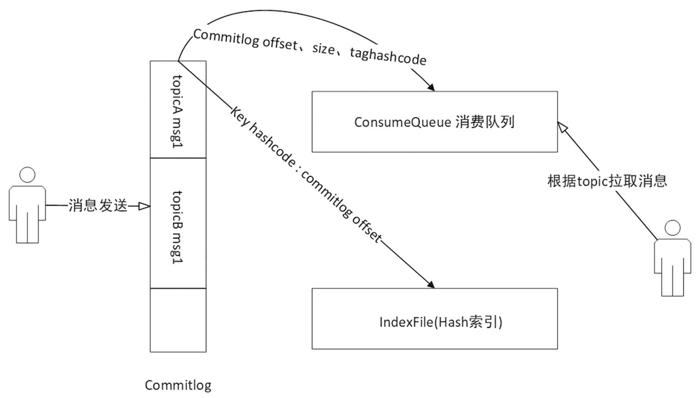

* 1）CommitLog：消息存储文件，所有消息主题的消息都存储在CommitLog文件中。
* 2）ConsumeQueue：消息消费队列，消息到达CommitLog文件后，将异步转发到消息消费队列，供消息消费者消费。
* 3）IndexFile：消息索引文件，主要存储消息Key与Offset的对应关系。
* 4）事务状态服务：存储每条消息的事务状态。
* 5）定时消息服务：每一个延迟级别对应一个消息消费队列，存储延迟队列的消息拉取进度。

##4.2 初识消息存储
消息存储实现类：`org.apache.rocketmq.store.DefaultMessageStore`

它是存储模块里面最重要的一个类，包含了很多对存储文件操作的API，其他模块对消息实体的操作都是通过DefaultMessageStore进行操作，其类图如图4-2所示

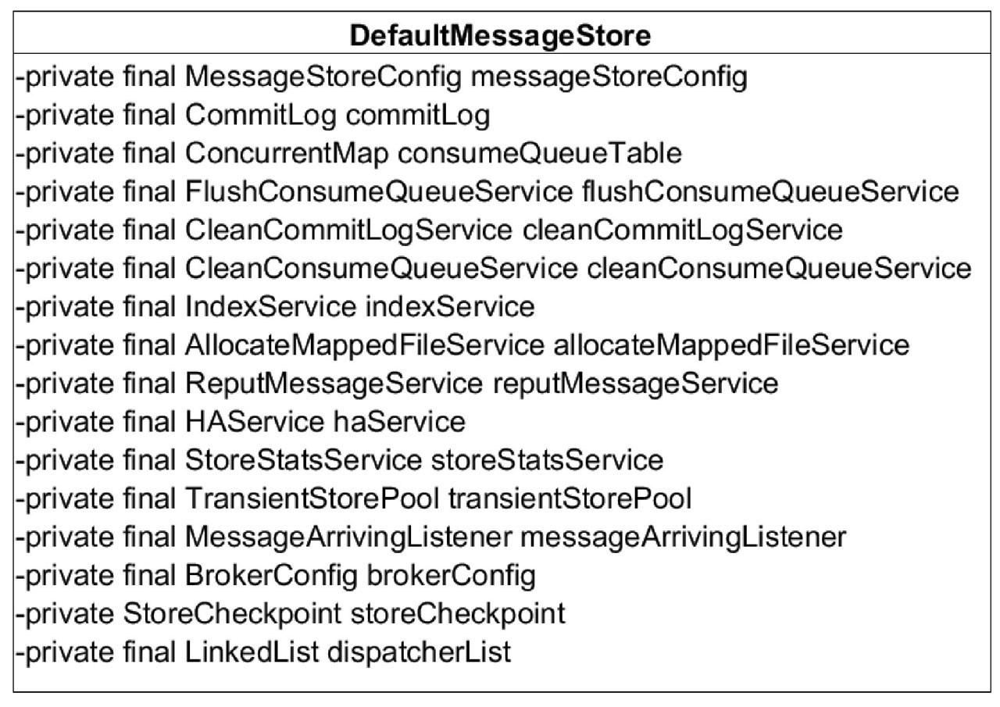

让我们来一一介绍DefaultMessageStore的核心属性。
* 1）MessageStoreConfig messageStoreConfig：消息存储配置属性。
* 2）CommitLog commitLog:CommitLog文件的存储实现类。
* 3）ConcurrentMap<String/* topic */, ConcurrentMap<Integer/* queueId */, Consume-Queue>> consumeQueueTable：消息队列存储缓存表，按消息主题分组。
* 4）FlushConsumeQueueService flushConsumeQueueService：消息队列文件ConsumeQueue刷盘线程。
* 5）CleanCommitLogService cleanCommitLogService：清除CommitLog文件服务。
* 6）CleanConsumeQueueService cleanConsumeQueueService：清除ConsumeQueue文件服务。
* 7）IndexService indexService：索引文件实现类。
* 8）AllocateMappedFileService allocateMappedFileService:MappedFile分配服务。
* 9）ReputMessageService reputMessageService:CommitLog消息分发，根据CommitLog文件构建ConsumeQueue、IndexFile文件。
* 10）HAService haService：存储HA机制。
* 11）TransientStorePool transientStorePool：消息堆内存缓存。
* 12）MessageArrivingListener messageArrivingListener：消息拉取长轮询模式消息达到监听器。
* 13）BrokerConfig brokerConfig:Broker配置属性。
* 14）StoreCheckpoint storeCheckpoint：文件刷盘检测点。
* 15）LinkedList<CommitLogDispatcher> dispatcherList:CommitLog文件转发请求。

##4.3 消息发送存储流程

消息存储入口：`org.apache.rocketmq.store.DefaultMessageStore#putMessage`

Step1：如果当前Broker停止工作或Broker为SLAVE角色或当前Rocket不支持写入则拒绝消息写入；如果消息主题长度超过256个字符、消息属性长度超过65536个字符将拒绝该消息写入。
```xml
如果日志中包含“message store is not writeable, so putMessage is forbidden”，出现这种日志最有可能是磁盘空间不足，在写ConsumeQueue、IndexFile文件出现错误时会拒绝消息再次写入。
```

Step2：如果消息的延迟级别大于0，将消息的原主题名称与原消息队列ID存入消息属性中，用延迟消息主题SCHEDULE_TOPIC、消息队列ID更新原先消息的主题与队列，这是并发消息消费重试关键的一步，下一章会重点探讨消息重试机制与定时消息的实现原理

**代码清单4-1 CommitLog#putMessage**
```java
MappedFile unlockMappedFile = null;
MappedFile mappedFile = this.mappedFileQueue.getLastMappedFile();
```
Step3：获取当前可以写入的Commitlog文件，RocketMQ物理文件的组织方式如图4-3所示
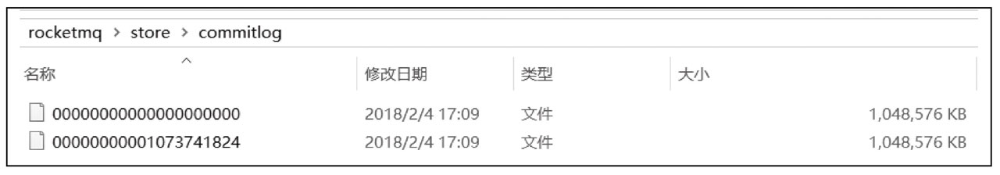

Commitlog文件存储目录为${ROCKET_HOME}/store/commitlog目录，每一个文件默认1G，一个文件写满后再创建另外一个，以该文件中第一个偏移量为文件名，偏移量小于20位用0补齐。图4-3所示的第一个文件初始偏移量为0，第二个文件的1073741824，代表该文件中的第一条消息的物理偏移量为1073741824，这样根据物理偏移量能快速定位到消息。MappedFileQueue可以看作是${ROCKET_HOME}/store/commitlog文件夹，而MappedFile则对应该文件夹下一个个的文件。

Step4：在写入CommitLog之前，先申请putMessageLock，也就是将消息存储到CommitLog文件中是串行的。

```java
putMessageLock.lock();
try {
long beginLockTimestamp = this.defaultMessageStore.getSystemClock().now();
this.beginTimeInLock = beginLockTimestamp;

// Here settings are stored timestamp, in order to ensure an orderly
// global
messageExtBatch.setStoreTimestamp(beginLockTimestamp);

if (null == mappedFile || mappedFile.isFull()) {
    mappedFile = this.mappedFileQueue.getLastMappedFile(0); // Mark: NewFile may be cause noise
}
if (null == mappedFile) {
    log.error("Create mapped file1 error, topic: {} clientAddr: {}", messageExtBatch.getTopic(), messageExtBatch.getBornHostString());
    return CompletableFuture.completedFuture(new PutMessageResult(PutMessageStatus.CREATE_MAPEDFILE_FAILED, null));
}
```
Step5：设置消息的存储时间，如果mappedFile为空，表明${ROCKET_HOME}/store/commitlog目录下不存在任何文件，说明本次消息是第一次消息发送，用偏移量0创建第一个commit文件，文件为00000000000000000000，如果文件创建失败，抛出CREATE_MAPEDFILE_FAILED，很有可能是磁盘空间不足或权限不够。

**代码清单4-3 MappedFile#appendMessagesInner**

```java
public AppendMessageResult appendMessagesInner(final MessageExt messageExt, final AppendMessageCallback cb,
    PutMessageContext putMessageContext) {
assert messageExt != null;
assert cb != null;

int currentPos = this.wrotePosition.get();

if (currentPos < this.fileSize) {
    ByteBuffer byteBuffer = writeBuffer != null ? writeBuffer.slice() : this.mappedByteBuffer.slice();
    byteBuffer.position(currentPos);
    AppendMessageResult result;
    if (messageExt instanceof MessageExtBrokerInner) {
        result = cb.doAppend(this.getFileFromOffset(), byteBuffer, this.fileSize - currentPos,
                (MessageExtBrokerInner) messageExt, putMessageContext);
    } else if (messageExt instanceof MessageExtBatch) {
        result = cb.doAppend(this.getFileFromOffset(), byteBuffer, this.fileSize - currentPos,
                (MessageExtBatch) messageExt, putMessageContext);
    } else {
        return new AppendMessageResult(AppendMessageStatus.UNKNOWN_ERROR);
    }
    this.wrotePosition.addAndGet(result.getWroteBytes());
    this.storeTimestamp = result.getStoreTimestamp();
    return result;
}
log.error("MappedFile.appendMessage return null, wrotePosition: {} fileSize: {}", currentPos, this.fileSize);
return new AppendMessageResult(AppendMessageStatus.UNKNOWN_ERROR);
}
```
Step6：将消息追加到MappedFile中。首先先获取MappedFile当前写指针，如果currentPos大于或等于文件大小则表明文件已写满，抛出AppendMessageStatus.UNKNOWN_ERROR。如果currentPos小于文件大小，通过slice（）方法创建一个与MappedFile的共享内存区，并设置position为当前指针。

**代码清单4-4 CommitLog$DefaultAppendMessageCallback#doAppend**
```java
String msgId = UtilAll.bytes2string(msgIdBuffer.array());
```
但为了消息ID可读性，返回给应用程序的msgId为字符类型，可以通过UtilAll. bytes2string方法将msgId字节数组转换成字符串，通过UtilAll.string2bytes方法将msgId字符串还原成16个字节的字节数组，从而根据提取消息偏移量，可以快速通过msgId找到消息内容.

```java
Long queueOffset = CommitLog.this.topicQueueTable.get(key);
```
Step8：获取该消息在消息队列的偏移量。CommitLog中保存了当前所有消息队列的当前待写入偏移量。

代码清单4-6 CommitLog#calMsgLength
```java
protected static int calMsgLength(int sysFlag, int bodyLength, int topicLength, int propertiesLength) {
    int bornhostLength = (sysFlag & MessageSysFlag.BORNHOST_V6_FLAG) == 0 ? 8 : 20;
    int storehostAddressLength = (sysFlag & MessageSysFlag.STOREHOSTADDRESS_V6_FLAG) == 0 ? 8 : 20;
    final int msgLen = 4 //TOTALSIZE
        + 4 //MAGICCODE
        + 4 //BODYCRC
        + 4 //QUEUEID
        + 4 //FLAG
        + 8 //QUEUEOFFSET
        + 8 //PHYSICALOFFSET
        + 4 //SYSFLAG
        + 8 //BORNTIMESTAMP
        + bornhostLength //BORNHOST
        + 8 //STORETIMESTAMP
        + storehostAddressLength //STOREHOSTADDRESS
        + 4 //RECONSUMETIMES
        + 8 //Prepared Transaction Offset
        + 4 + (bodyLength > 0 ? bodyLength : 0) //BODY
        + 1 + topicLength //TOPIC
        + 2 + (propertiesLength > 0 ? propertiesLength : 0) //propertiesLength
        + 0;
    return msgLen;
}
```
Step9：根据消息体的长度、主题的长度、属性的长度结合消息存储格式计算消息的总长度

**RocketMQ消息存储格式如下。**
* 1）TOTALSIZE：该消息条目总长度，4字节。
* 2）MAGICCODE：魔数，4字节。固定值0xdaa320a7。
* 3）BODYCRC：消息体crc校验码，4字节。
* 4）QUEUEID：消息消费队列ID,4字节。
* 5）FLAG：消息FLAG, RocketMQ不做处理，供应用程序使用，默认4字节。
* 6）QUEUEOFFSET：消息在消息消费队列的偏移量，8字节。
* 7）PHYSICALOFFSET：消息在CommitLog文件中的偏移量，8字节。
* 8）SYSFLAG：消息系统Flag，例如是否压缩、是否是事务消息等，4字节。
* 9）BORNTIMESTAMP：消息生产者调用消息发送API的时间戳，8字节。
* 10）BORNHOST：消息发送者IP、端口号，8字节。
* 11）STORETIMESTAMP：消息存储时间戳，8字节。
* 12）STOREHOSTADDRESS:Broker服务器IP+端口号，8字节。
* 13）RECONSUMETIMES：消息重试次数，4字节。
* 14）Prepared Transaction Offset：事务消息物理偏移量，8字节。
* 15）BodyLength：消息体长度，4字节。
* 16）Body：消息体内容，长度为bodyLenth中存储的值。
* 17）TopicLength：主题存储长度，1字节，表示主题名称不能超过255个字符。
* 18）Topic：主题，长度为TopicLength中存储的值。
* 19）PropertiesLength：消息属性长度，2字节，表示消息属性长度不能超过65536个字符。
* 20）Properties：消息属性，长度为PropertiesLength中存储的值。

上述表示CommitLog条目是不定长的，每一个条目的长度存储在前4个字节中.

##4.4 存储文件组织与内存映射

RocketMQ通过使用内存映射文件来提高IO访问性能，无论是CommitLog、ConsumeQueue还是IndexFile，单个文件都被设计为固定长度，如果一个文件写满以后再创建一个新文件，文件名就为该文件第一条消息对应的全局物理偏移量。例如CommitLog文件的组织方式如图4-6所示


RocketMQ使用MappedFile、MappedFileQueue来封装存储文件，其关系如图4-7所示.

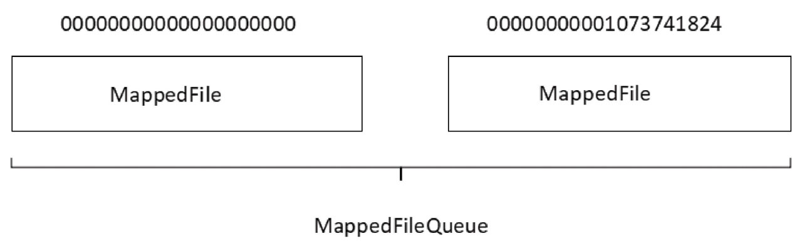

###4.4.1 MappedFileQueue映射文件队列

MappedFileQueue是MappedFile的管理容器，MappedFileQueue是对存储目录的封装，例如CommitLog文件的存储路径${ROCKET_HOME}/store/commitlog/，该目录下会存在多个内存映射文件（MappedFile）。MappedFileQueue类图如图4-8所示

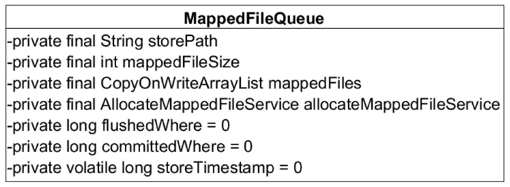

**下面让我们一一来介绍`MappedFileQueue`的核心属性。**
* 1）String storePath：存储目录。
* 2）int mappedFileSize：单个文件的存储大小。
* 3）CopyOnWriteArrayList<MappedFile> mappedFiles:MappedFile文件集合。
* 4）AllocateMappedFileService allocateMappedFileService：创建MappedFile服务类。
* 5）long flushedWhere = 0：当前刷盘指针，表示该指针之前的所有数据全部持久化到磁盘。
* 6）long committedWhere = 0：当前数据提交指针，内存中ByteBuffer当前的写指针，该值大于等于flushedWhere。

接下来重点分析一下根据不同查询维度查找MappedFile。

* MappedFileQueue#getMappedFileByTime, 根据消息存储时间戳来查找MappdFile。从MappedFile列表中第一个文件开始查找，找到第一个最后一次更新时间大于待查找时间戳的文件，如果不存在，则返回最后一个MappedFile文件
* MappedFileQueue#findMappedFileByOffset, 根据消息偏移量offset查找MappedFile。根据offet查找MappedFile直接使用offset%-mapped FileSize是否可行？答案是否定的，由于使用了内存映射，只要存在于存储目录下的文件，都需要对应创建内存映射文件，如果不定时将已消费的消息从存储文件中删除，会造成极大的内存压力与资源浪费，所有RocketMQ采取定时删除存储文件的策略，也就是说在存储文件中，第一个文件不一定是00000000000000000000，因为该文件在某一时刻会被删除，故根据offset定位MappedFile的算法为（int）（（offset / this.mappedFileSize）-（mappedFile.getFileFromOffset（）/ this.MappedFileSize））。

###4.4.2 MappedFile内存映射文件

MappedFile是RocketMQ内存映射文件的具体实现，如图4-9所示

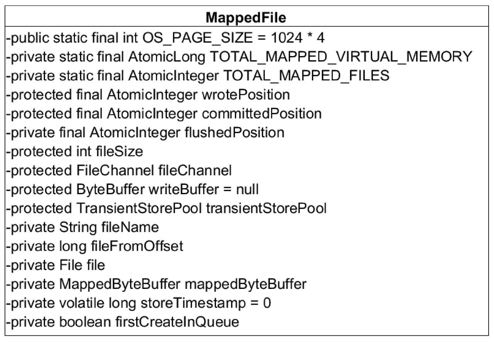

**下面让我们一一来介绍`MappedFile`的核心属性。**
* 1）int OS_PAGE_SIZE：操作系统每页大小，默认4k。
* 2）AtomicLong TOTAL_MAPPED_VIRTUAL_MEMORY：当前JVM实例中Mapped-File虚拟内存。
* 3）AtomicInteger TOTAL_MAPPED_FILES：当前JVM实例中MappedFile对象个数。
* 4）AtomicInteger wrotePosition：当前该文件的写指针，从0开始（内存映射文件中的写指针）。
* 5）AtomicInteger committedPosition：当前文件的提交指针，如果开启transientStore-PoolEnable，则数据会存储在TransientStorePool中，然后提交到内存映射ByteBuffer中，再刷写到磁盘。
* 6）AtomicInteger flushedPosition：刷写到磁盘指针，该指针之前的数据持久化到磁盘中。
* 7）int fileSize：文件大小。
* 8）FileChannel fileChannel：文件通道。
* 9）ByteBuffer writeBuffer：堆内存ByteBuffer，如果不为空，数据首先将存储在该Buffer中，然后提交到MappedFile对应的内存映射文件Buffer。transientStorePoolEnable为true时不为空。
* 10）TransientStorePool transientStorePool：堆内存池，transientStorePoolEnable为true时启用。
* 11）String fileName：文件名称。
* 12）long fileFromOffset：该文件的初始偏移量。
* 13）File file：物理文件。
* 14）MappedByteBuffer mappedByteBuffer：物理文件对应的内存映射Buffer。
* 15）volatile long storeTimestamp = 0：文件最后一次内容写入时间。
* 16）boolean firstCreateInQueue：是否是MappedFileQueue队列中第一个文件。

####1．MappedFile初始化

根据是否开启transientStorePoolEnable存在两种初始化情况。transientStorePoolEnable为true表示内容先存储在堆外内存，然后通过Commit线程将数据提交到内存映射Buffer中，再通过Flush线程将内存映射Buffer中的数据持久化到磁盘中。

####2．MappedFile提交(commit)

内存映射文件的提交动作由MappedFile的commit方法实现

####3．MappedFile刷盘(flush)

刷盘指的是将内存中的数据刷写到磁盘，永久存储在磁盘中，其具体实现由MappedFile的flush方法实现

####4．获取MappedFile最大读指针（getReadPosition）

RocketMQ文件的一个组织方式是内存映射文件，预先申请一块连续的固定大小的内存，需要一套指针标识当前最大有效数据的位置，获取最大有效数据偏移量的方法由MappedFile的getReadPosition方法实现

####5．MappedFile销毁(destory)

MappedFile文件销毁的实现方法为public boolean destroy（final long intervalForcibly）, intervalForcibly表示拒绝被销毁的最大存活时间。

###4.4.3 TransientStorePool

TransientStorePool：短暂的存储池。RocketMQ单独创建一个MappedByteBuffer内存缓存池，用来临时存储数据，数据先写入该内存映射中，然后由commit线程定时将数据从该内存复制到与目的物理文件对应的内存映射中。RokcetMQ引入该机制主要的原因是提供一种内存锁定，将当前堆外内存一直锁定在内存中，避免被进程将内存交换到磁盘。TransientStorePool类图如图4-10所示

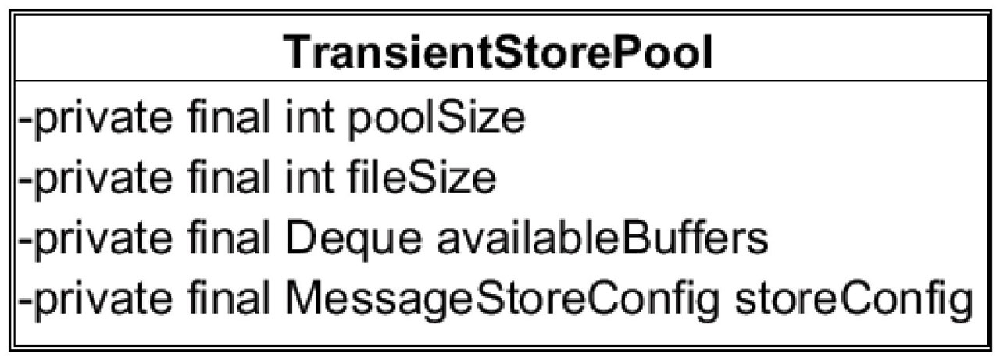

下面让我们一一介绍TransientStorePool的核心属性。
* 1）int poolSize:avaliableBuffers个数，可通过在broker中配置文件中设置transient-Store PoolSize，默认为5。
* 2）int fileSize：每个ByteBuffer大小，默认为mapedFileSizeCommitLog，表明Tran s-ient StorePool为commitlog文件服务。
* 3）Deque<ByteBuffer> availableBuffers:ByteBuffer容器，双端队列。

**代码清单4-29 TransientStorePool#init**

```java
public void init() {
    for (int i = 0; i < poolSize; i++) {
        ByteBuffer byteBuffer = ByteBuffer.allocateDirect(fileSize);

        final long address = ((DirectBuffer) byteBuffer).address();
        Pointer pointer = new Pointer(address);
        LibC.INSTANCE.mlock(pointer, new NativeLong(fileSize));

        availableBuffers.offer(byteBuffer);
    }
}
```
创建poolSize个堆外内存，并利用com.sun.jna.Library类库将该批内存锁定，避免被置换到交换区，提高存储性能。

##4.5 RocketMQ存储文件

RocketMQ存储路径为${ROCKET_HOME}/store，主要存储文件如图4-11所示

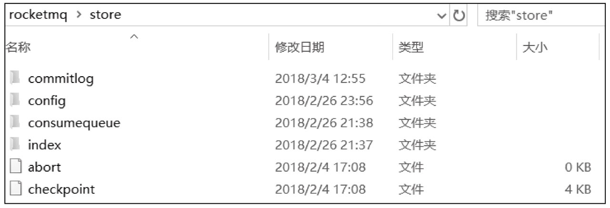

下面让我们一一介绍一下RocketMQ主要的存储文件夹。
* 1）commitlog：消息存储目录。
* 2）config：运行期间一些配置信息，主要包括下列信息。
  * consumerFilter.json：主题消息过滤信息。
  * consumerOffset.json：集群消费模式消息消费进度。
  * delayOffset.json：延时消息队列拉取进度。
  * subscriptionGroup.json：消息消费组配置信息。
  * topics.json:topic配置属性。
* 3）consumequeue：消息消费队列存储目录。
* 4）index：消息索引文件存储目录。
* 5）abort：如果存在abort文件说明Broker非正常关闭，该文件默认启动时创建，正常退出之前删除。
* 6）checkpoint：文件检测点，存储commitlog文件最后一次刷盘时间戳、consumequeue最后一次刷盘时间、index索引文件最后一次刷盘时间戳。

###4.5.1 Commitlog文件

commitlog目录的组织方式在4.4节中已经详细介绍过了，该目录下的文件主要存储消息，其特点是每一条消息长度不相同，消息存储协议已在4.3节中详细描述，

Commitlog文件存储的逻辑视图如图4-12所示，每条消息的前面4个字节存储该条消息的总长度。

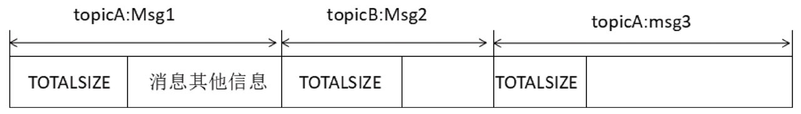

Commitlog文件的存储目录默认为${ROCKET_HOME}/store/commitlog，可以通过在broker配置文件中设置storePathRootDir属性来改变默认路径。commitlog文件默认大小为1G，可通过在broker配置文件中设置mapedFileSizeCommitLog属性来改变默认大小。
本节将基于上述存储结构重点分析消息的查找实现，其他诸如文件刷盘、文件恢复机制等将在下文中详细介绍。

**代码清单4-32 Commitlog#getMessage**
```java
public SelectMappedBufferResult getMessage(final long offset, final int size) {
    int mappedFileSize = this.defaultMessageStore.getMessageStoreConfig().getMappedFileSizeCommitLog();
    MappedFile mappedFile = this.mappedFileQueue.findMappedFileByOffset(offset, offset == 0);
    if (mappedFile != null) {
        int pos = (int) (offset % mappedFileSize);
        return mappedFile.selectMappedBuffer(pos, size);
    }
    return null;
}
```
根据偏移量与消息长度查找消息。首先根据偏移找到所在的物理偏移量，然后用offset与文件长度取余得到在文件内的偏移量，从该偏移量读取size长度的内容返回即可。如果只根据消息偏移查找消息，则首先找到文件内的偏移量，然后尝试读取4个字节获取消息的实际长度，最后读取指定字节即可.

###4.5.2 ConsumeQueue文件

RocketMQ基于主题订阅模式实现消息消费，消费者关心的是一个主题下的所有消息，但由于同一主题的消息不连续地存储在commitlog文件中，试想一下如果消息消费者直接从消息存储文件（commitlog）中去遍历查找订阅主题下的消息，效率将极其低下，RocketMQ为了适应消息消费的检索需求，设计了消息消费队列文件（Consumequeue），该文件可以看成是Commitlog关于消息消费的“索引”文件，consumequeue的第一级目录为消息主题，第二级目录为主题的消息队列，如图4-13所示.

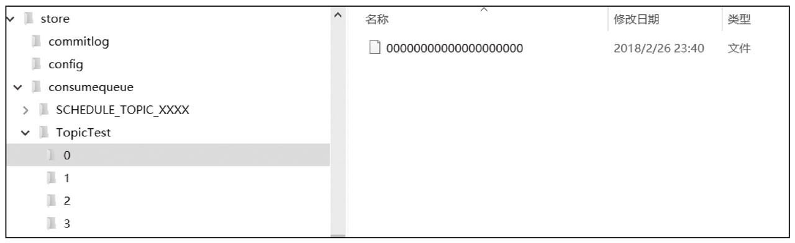

为了加速ConsumeQueue消息条目的检索速度与节省磁盘空间，每一个Consumequeue条目不会存储消息的全量信息，其存储格式如图4-14所示。

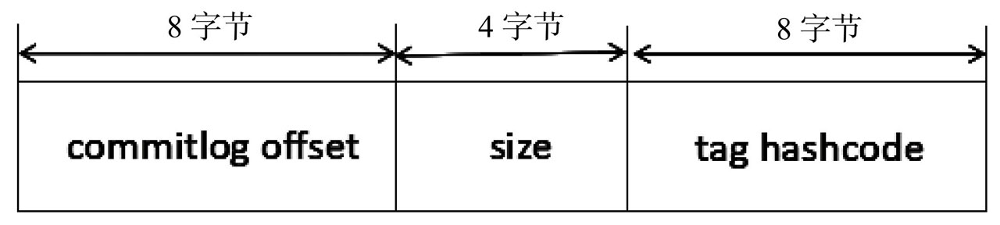

单个ConsumeQueue文件中默认包含30万个条目，单个文件的长度为30w×20字节，单个ConsumeQueue文件可以看出是一个ConsumeQueue条目的数组，其下标为Consume-Queue的逻辑偏移量，消息消费进度存储的偏移量即逻辑偏移量。ConsumeQueue即为Commitlog文件的索引文件，其构建机制是当消息到达Commitlog文件后，由专门的线程产生消息转发任务，从而构建消息消费队列文件与下文提到的索引文件。

本节只分析如何根据消息逻辑偏移量、时间戳查找消息的实现，下一节将重点讨论消息消费队列的构建、恢复等

###4.5.3 Index索引文件

消息消费队列是RocketMQ专门为消息订阅构建的索引文件，提高根据主题与消息队列检索消息的速度，另外RocketMQ引入了Hash索引机制为消息建立索引，HashMap的设计包含两个基本点：Hash槽与Hash冲突的链表结构。RocketMQ索引文件布局如图4-15所示.

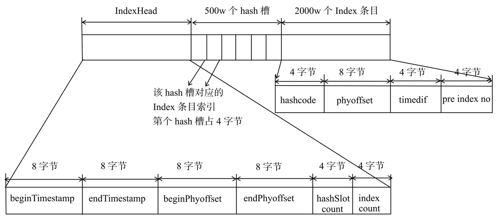

从图中可以看出，IndexFile总共包含IndexHeader、Hash槽、Hash条目（数据）。
* 1）IndexHeader头部，包含40个字节，记录该IndexFile的统计信息，其结构如下。
   * beginTimestamp：该索引文件中包含消息的最小存储时间。
   * endTimestamp：该索引文件中包含消息的最大存储时间。
   * beginPhyoffset：该索引文件中包含消息的最小物理偏移量（commitlog文件偏移量）。
   * endPhyoffset：该索引文件中包含消息的最大物理偏移量（commitlog文件偏移量）。
   * hashslotCount:hashslot个数，并不是hash槽使用的个数，在这里意义不大。
   * indexCount:Index条目列表当前已使用的个数，Index条目在Index条目列表中按顺序存储。
* 2）Hash槽，一个IndexFile默认包含500万个Hash槽，每个Hash槽存储的是落在该Hash槽的hashcode最新的Index的索引。
* 3）Index条目列表，默认一个索引文件包含2000万个条目，每一个Index条目结构如下。
   * hashcode:key的hashcode。
   * phyoffset：消息对应的物理偏移量。
   * timedif：该消息存储时间与第一条消息的时间戳的差值，小于0该消息无效。
   * preIndexNo：该条目的前一条记录的Index索引，当出现hash冲突时，构建的链表结构。

接下来将重点分析如何将Map<String/*消息索引key*/, long phyOffset/*消息物理偏移量*/>存入索引文件，以及如何根据消息索引key快速查找消息。

RocketMQ将消息索引键与消息偏移量映射关系写入到IndexFile的实现方法为：public boolean putKey（final String key, final long phyOffset, final long storeTimestamp），参数含义分别为消息索引、消息物理偏移量、消息存储时间。

**代码清单4-38 IndexFile#putKey**

```java
public boolean putKey(final String key, final long phyOffset, final long storeTimestamp) {
if (this.indexHeader.getIndexCount() < this.indexNum){
        int keyHash=indexKeyHashMethod(key);
        int slotPos=keyHash%this.hashSlotNum;
        int absSlotPos=IndexHeader.INDEX_HEADER_SIZE+slotPos*hashSlotSize;
        、、、、
}
```

###4.5.4 checkpoint文件

checkpoint的作用是记录Comitlog、ConsumeQueue、Index文件的刷盘时间点，文件固定长度为4k，其中只用该文件的前面24个字节，其存储格式如图4-16所示。

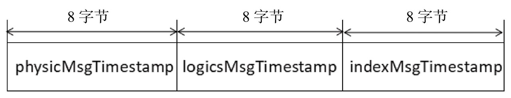

* physicMsgTimestamp:commitlog文件刷盘时间点。
* logicsMsgTimestamp：消息消费队列文件刷盘时间点。
* indexMsgTimestamp：索引文件刷盘时间点

##4.6 实时更新消息消费队列与索引文件

消息消费队列文件、消息属性索引文件都是基于CommitLog文件构建的，当消息生产者提交的消息存储在Commitlog文件中，ConsumeQueue、IndexFile需要及时更新，否则消息无法及时被消费，根据消息属性查找消息也会出现较大延迟。

RocketMQ通过开启一个线程`ReputMessageServcie`来准实时转发CommitLog文件更新事件，相应的任务处理器根据转发的消息及时更新ConsumeQueue、IndexFile文件。

**代码清单4-47 DefaultMessageStore#start**

```java
this.reputMessageService.setReputFromOffset(maxPhysicalPosInLogicQueue);
this.reputMessageService.start();
```
Broker服务器在启动时会启动ReputMessageService线程，并初始化一个非常关键的参数reputFfomOffset，该参数的含义是ReputMessageService从哪个物理偏移量开始转发消息给ConsumeQueue和IndexFile。如果允许重复转发，reputFromOffset设置为CommitLog的提交指针；如果不允许重复转发，reputFromOffset设置为Commitlog的内存中最大偏移量。

ReputMessageService线程每执行一次任务推送休息1毫秒就继续尝试推送消息到消息消费队列和索引文件，消息消费转发的核心实现在doReput方法中实现

###4.6.1 根据消息更新ConumeQueue

消息消费队列转发任务实现类为：CommitLogDispatcherBuildConsumeQueue，内部最终将调用putMessagePositionInfo方法

###4.6.2 根据消息更新Index索引文件

Hash索引文件转发任务实现类：CommitLogDispatcherBuildIndex

##4.7 消息队列与索引文件恢复

由于RocketMQ存储首先将消息全量存储在Commitlog文件中，然后异步生成转发任务更新ConsumeQueue、Index文件。如果消息成功存储到Commitlog文件中，转发任务未成功执行，此时消息服务器Broker由于某个原因宕机，导致Commitlog、ConsumeQueue、IndexFile文件数据不一致。如果不加以人工修复的话，会有一部分消息即便在Commitlog文件中存在，但由于并没有转发到Consumequeue，这部分消息将永远不会被消费者消费。那RocketMQ是如何使Commitlog、消息消费队列（ConsumeQueue）达到最终一致性的呢？

**代码清单4-57 DefaultMessageStore#load**

###4.7.1 Broker正常停止文件恢复

Broker正常停止文件恢复的实现为CommitLog#recoverNormally。

###4.7.2 Broker异常停止文件恢复

Broker异常停止文件恢复的实现为CommitLog#recoverAbnormally。异常文件恢复的步骤与正常停止文件恢复的流程基本相同，其主要差别有两个。首先，正常停止默认从倒数第三个文件开始进行恢复，而异常停止则需要从最后一个文件往前走，找到第一个消息存储正常的文件。其次，如果commitlog目录没有消息文件，如果在消息消费队列目录下存在文件，则需要销毁.

如何判断一个消息文件是一个正确的文件呢？

代码清单4-69 CommitLog#isMappedFileMatchedRecover

##4.8 文件刷盘机制

RocketMQ的存储与读写是基于JDK NIO的内存映射机制（MappedByteBuffer）的，消息存储时首先将消息追加到内存，再根据配置的刷盘策略在不同时间进行刷写磁盘。如果是同步刷盘，消息追加到内存后，将同步调用MappedByteBuffer的force（）方法；如果是异步刷盘，在消息追加到内存后立刻返回给消息发送端。RocketMQ使用一个单独的线程按照某一个设定的频率执行刷盘操作。通过在broker配置文件中配置flushDiskType来设定刷盘方式，可选值为ASYNC_FLUSH（异步刷盘）、SYNC_FLUSH（同步刷盘），默认为异步刷盘。本书默认以消息存储文件Commitlog文件刷盘机制为例来剖析RocketMQ的刷盘机制，ConsumeQueue、IndexFile刷盘的实现原理与Commitlog刷盘机制类似。RocketMQ处理刷盘的实现方法为Commitlog#handleDiskFlush（）方法，刷盘流程作为消息发送、消息存储的子流程，请先重点了解4.3节中关于消息存储流程的相关知识。值得注意的是索引文件的刷盘并不是采取定时刷盘机制，而是每更新一次索引文件就会将上一次的改动刷写到磁盘。

###4.8.1 Broker同步刷盘

同步刷盘，指的是在消息追加到内存映射文件的内存中后，立即将数据从内存刷写到磁盘文件，由CommitLog的handleDiskFlush方法实现，如代码清单4-73所示。

**代码清单4-73 CommitLog#handleDiskFlush**

同步刷盘实现流程如下。
* 1）构建GroupCommitRequest同步任务并提交到GroupCommitRequest。
* 2）等待同步刷盘任务完成，如果超时则返回刷盘错误，刷盘成功后正常返回给调用方。

消费发送线程将消息追加到内存映射文件后，将同步任务GroupCommitRequest提交到GroupCommitService线程，然后调用阻塞等待刷盘结果，超时时间默认为5s。

###4.8.2 Broker异步刷盘

代码清单4-80 CommitLog#handleDiskFlush

异步刷盘根据是否开启transientStorePoolEnable机制，刷盘实现会有细微差别。如果transientStorePoolEnable为true, RocketMQ会单独申请一个与目标物理文件（commitlog）同样大小的堆外内存，该堆外内存将使用内存锁定，确保不会被置换到虚拟内存中去，消息首先追加到堆外内存，然后提交到与物理文件的内存映射内存中，再flush到磁盘。如果transientStorePoolEnable为flalse，消息直接追加到与物理文件直接映射的内存中，然后刷写到磁盘中。transientStorePoolEnable为true的磁盘刷写流程如图4-20所示。

磁盘刷鞋流程

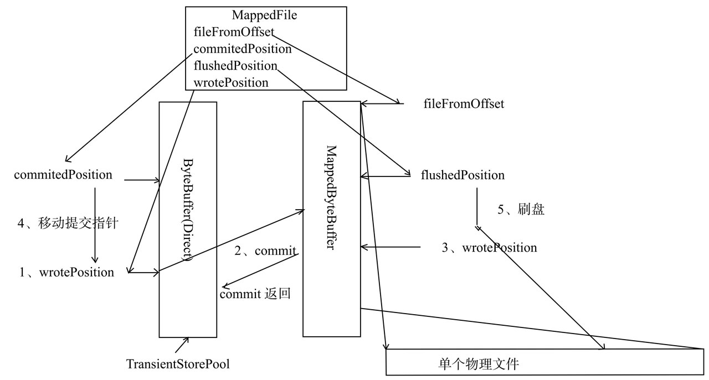

* 1）首先将消息直接追加到ByteBuffer（堆外内存DirectByteBuffer）, wrotePosition随着消息的不断追加向后移动。
* 2）CommitRealTimeService线程默认每200ms将ByteBuffer新追加的内容（wrotePosition减去commitedPosition）的数据提交到MappedByteBuffer中。
* 3）MappedByteBuffer在内存中追加提交的内容，wrotePosition指针向前后移动，然后返回。
* 4）commit操作成功返回，将commitedPosition向前后移动本次提交的内容长度，此时wrotePosition指针依然可以向前推进。
* 5）FlushRealTimeService线程默认每500ms将MappedByteBuffer中新追加的内存（wrote Position减去上一次刷写位置flushedPositiont）通过调用MappedByteBuffer#force（）方法将数据刷写到磁盘

**1．CommitRealTimeService提交线程工作机制**

##4.9 过期文件删除机制

由于RocketMQ操作CommitLog、ConsumeQueue文件是基于内存映射机制并在启动的时候会加载commitlog、ConsumeQueue目录下的所有文件，为了避免内存与磁盘的浪费，不可能将消息永久存储在消息服务器上，所以需要引入一种机制来删除已过期的文件。RocketMQ顺序写Commitlog文件、ConsumeQueue文件，所有写操作全部落在最后一个CommitLog或ConsumeQueue文件上，之前的文件在下一个文件创建后将不会再被更新。RocketMQ清除过期文件的方法是：如果非当前写文件在一定时间间隔内没有再次被更新，则认为是过期文件，可以被删除，RocketMQ不会关注这个文件上的消息是否全部被消费。默认每个文件的过期时间为72小时，通过在Broker配置文件中设置fileReservedTime来改变过期时间，单位为小时。接下来详细分析RocketMQ是如何设计与实现上述机制的。

**代码清单4-88 DefaultMessageStore#addScheduleTask**

##4.10 本章小结

RocketMQ主要存储文件包含消息文件（commitlog）、消息消费队列文件（Consume-Queue）、Hash索引文件（IndexFile）、检测点文件（checkpoint）、abort（关闭异常文件）。单个消息存储文件、消息消费队列文件、Hash索引文件长度固定以便使用内存映射机制进行文件的读写操作。RocketMQ组织文件以文件的起始偏移量来命名文件，这样根据偏移量能快速定位到真实的物理文件。RocketMQ基于内存映射文件机制提供了同步刷盘与异步刷盘两种机制，异步刷盘是指在消息存储时先追加到内存映射文件，然后启动专门的刷盘线程定时将内存中的数据刷写到磁盘。

Commitlog，消息存储文件，RocketMQ为了保证消息发送的高吞吐量，采用单一文件存储所有主题的消息，保证消息存储是完全的顺序写，但这样给文件读取同样带来了不便，为此RocketMQ为了方便消息消费构建了消息消费队列文件，基于主题与队列进行组织，同时RocketMQ为消息实现了Hash索引，可以为消息设置索引键，根据索引能够快速从Commitog文件中检索消息。

当消息到达Commitlog文件后，会通过ReputMessageService线程接近实时地将消息转发给消息消费队列文件与索引文件。为了安全起见，RocketMQ引入abort文件，记录Broker的停机是正常关闭还是异常关闭，在重启Broker时为了保证Commitlog文件、消息消费队列文件与Hash索引文件的正确性，分别采取不同的策略来恢复文件。

RocketMQ不会永久存储消息文件、消息消费队列文件，而是启用文件过期机制并在磁盘空间不足或默认在凌晨4点删除过期文件，文件默认保存72小时并且在删除文件时并不会判断该消息文件上的消息是否被消费。下面一章我们将重点分析有关消息消费的实现机制。
