#RocketMQ消息消费

消息成功发送到消息服务器后，接下来需要考虑的问题是如何消费消息，如何整合业务逻辑的处理。本章主要分析RocketMQ如何消费消息，重点剖析消息消费的过程中需要解决的问题。

##5.1 RocketMQ消息消费概述

消息消费以组的模式开展，一个消费组内可以包含多个消费者，每一个消费组可订阅多个主题，消费组之间有集群模式与广播模式两种消费模式。
* 集群模式，主题下的同一条消息只允许被其中一个消费者消费。
* 广播模式，主题下的同一条消息将被集群内的所有消费者消费一次。
  
消息服务器与消费者之间的消息传送也有两种方式：推模式、拉模式。
* 所谓的拉模式，是消费端主动发起拉消息请求，
* 而推模式是消息到达消息服务器后，推送给消息消费者。RocketMQ消息推模式的实现基于拉模式，在拉模式上包装一层，一个拉取任务完成后开始下一个拉取任务。

集群模式下，多个消费者如何对消息队列进行负载呢？消息队列负载机制遵循一个通用的思想：一个消息队列同一时间只允许被一个消费者消费，一个消费者可以消费多个消息队列。

RocketMQ支持局部顺序消息消费，也就是保证同一个消息队列上的消息顺序消费。不支持消息全局顺序消费，如果要实现某一主题的全局顺序消息消费，可以将该主题的队列数设置为1，牺牲高可用性。

RocketMQ支持两种消息过滤模式：表达式（TAG、SQL92）与类过滤模式。

消息拉模式，主要是由客户端手动调用消息拉取API，而消息推模式是消息服务器主动将消息推送到消息消费端，本章将以推模式为突破口重点介绍RocketMQ消息消费实现原理。

##5.2 消息消费者初探

消息消费分为推和拉两种模式，下面我们介绍推模式的消费者`MQPushConsumer`的主要API，如图5-1所示。

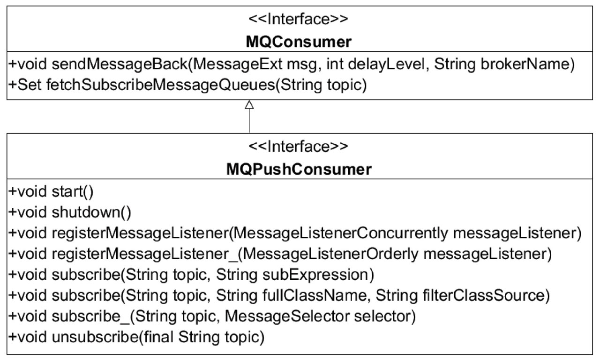

下面让我们来一一介绍MQPushConsumer的核心属性. 见源码注释。

**DefaultMQPushConsumer（推模式消息消费者）主要属性如图5-2所示**

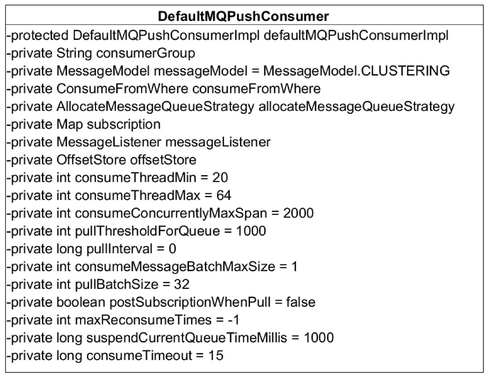

各属性说明见源码注释。

##5.3 消费者启动流程

消息消费者是如何启动的，请跟我一起来分析`DefaultMQPushConsumerImpl#start`方法，具体代码如下。

```java
public synchronized void start() throws MQClientException {
switch (this.serviceState) {
    case CREATE_JUST:
        log.info("the consumer [{}] start beginning. messageModel={}, isUnitMode={}", this.defaultMQPushConsumer.getConsumerGroup(),
            this.defaultMQPushConsumer.getMessageModel(), this.defaultMQPushConsumer.isUnitMode());
        this.serviceState = ServiceState.START_FAILED;

        this.checkConfig();
        // step1.构建主题订阅信息SubscriptionData并加入到RebalanceImpl的订阅消息中
        this.copySubscription();
        // step2.初始化MQClientInstance、RebalanceImple（消息重新负载实现类）等
        if (this.defaultMQPushConsumer.getMessageModel() == MessageModel.CLUSTERING) {
            this.defaultMQPushConsumer.changeInstanceNameToPID();
        }
        // 在一个JVM中的所有消费者、生产者持有同一个MQClientInstance, MQClientInstance只会启动一次
        this.mQClientFactory = MQClientManager.getInstance().getOrCreateMQClientInstance(this.defaultMQPushConsumer, this.rpcHook);

        this.rebalanceImpl.setConsumerGroup(this.defaultMQPushConsumer.getConsumerGroup());
        this.rebalanceImpl.setMessageModel(this.defaultMQPushConsumer.getMessageModel());
        this.rebalanceImpl.setAllocateMessageQueueStrategy(this.defaultMQPushConsumer.getAllocateMessageQueueStrategy());
        this.rebalanceImpl.setmQClientFactory(this.mQClientFactory);

        this.pullAPIWrapper = new PullAPIWrapper(
            mQClientFactory,
            this.defaultMQPushConsumer.getConsumerGroup(), isUnitMode());
        this.pullAPIWrapper.registerFilterMessageHook(filterMessageHookList);

        // step3.初始化消息进度。如果消息消费是集群模式，那么消息进度保存在Broker上；如果是广播模式，那么消息消费进度存储在消费端
        if (this.defaultMQPushConsumer.getOffsetStore() != null) {
            this.offsetStore = this.defaultMQPushConsumer.getOffsetStore();
        } else {
            switch (this.defaultMQPushConsumer.getMessageModel()) {
                case BROADCASTING:
                    this.offsetStore = new LocalFileOffsetStore(this.mQClientFactory, this.defaultMQPushConsumer.getConsumerGroup());
                    break;
                case CLUSTERING:
                    this.offsetStore = new RemoteBrokerOffsetStore(this.mQClientFactory, this.defaultMQPushConsumer.getConsumerGroup());
                    break;
                default:
                    break;
            }
            this.defaultMQPushConsumer.setOffsetStore(this.offsetStore);
        }
        this.offsetStore.load();

        // step4.根据是否是顺序消费，创建消费端消费线程服务。ConsumeMessageService主要负责消息消费，内部维护一个线程池
        if (this.getMessageListenerInner() instanceof MessageListenerOrderly) {
            this.consumeOrderly = true;
            this.consumeMessageService =
                new ConsumeMessageOrderlyService(this, (MessageListenerOrderly) this.getMessageListenerInner());
        } else if (this.getMessageListenerInner() instanceof MessageListenerConcurrently) {
            this.consumeOrderly = false;
            this.consumeMessageService =
                new ConsumeMessageConcurrentlyService(this, (MessageListenerConcurrently) this.getMessageListenerInner());
        }

        this.consumeMessageService.start();

        // step5.向MQClientInstance注册消费者，并启动MQClientInstance，在一个JVM中的所有消费者、生产者持有同一个MQClientInstance, MQClientInstance只会启动一次
        boolean registerOK = mQClientFactory.registerConsumer(this.defaultMQPushConsumer.getConsumerGroup(), this);
        if (!registerOK) {
            this.serviceState = ServiceState.CREATE_JUST;
            this.consumeMessageService.shutdown(defaultMQPushConsumer.getAwaitTerminationMillisWhenShutdown());
            throw new MQClientException("The consumer group[" + this.defaultMQPushConsumer.getConsumerGroup()
                + "] has been created before, specify another name please." + FAQUrl.suggestTodo(FAQUrl.GROUP_NAME_DUPLICATE_URL),
                null);
        }
        // 这里面会启动pullMessageService线程,pullMessageService.start()
        mQClientFactory.start();
        log.info("the consumer [{}] start OK.", this.defaultMQPushConsumer.getConsumerGroup());
        this.serviceState = ServiceState.RUNNING;
        break;
    case RUNNING:
    case START_FAILED:
    case SHUTDOWN_ALREADY:
        throw new MQClientException("The PushConsumer service state not OK, maybe started once, "
            + this.serviceState
            + FAQUrl.suggestTodo(FAQUrl.CLIENT_SERVICE_NOT_OK),
            null);
    default:
        break;
}

this.updateTopicSubscribeInfoWhenSubscriptionChanged();
this.mQClientFactory.checkClientInBroker();
this.mQClientFactory.sendHeartbeatToAllBrokerWithLock();
this.mQClientFactory.rebalanceImmediately();
}
```

##5.4 消息拉取

本节将基于PUSH模式来详细分析消息拉取机制。

消息消费有两种模式：广播模式与集群模式，广播模式比较简单，每一个消费者需要去拉取订阅主题下所有消费队列的消息，本节主要基于集群模式。在集群模式下，同一个消费组内有多个消息消费者，同一个主题存在多个消费队列，那么消费者如何进行消息队列负载呢？从上文启动流程也知道，每一个消费组内维护一个线程池来消费消息，那么这些线程又是如何分工合作的呢？

消息队列负载，通常的做法是一个消息队列在同一时间只允许被一个消息消费者消费，一个消息消费者可以同时消费多个消息队列，那么RocketMQ是如何实现的呢？带着上述问题，我们开始RocketMQ消息消费机制的探讨。

从MQClientInstance的启动流程中可以看出，RocketMQ使用一个单独的线程`PullMessageService`来负责消息的拉取.

###5.4.1 PullMessageService实现机制

PullMessageService继承的是ServiceThread，从名称来看，它是服务线程，通过run方法启动，具体代码如下:

```java
public void run() {
log.info(this.getServiceName() + " service started");
// 这是一种通用的设计技巧，stopped声明为volatile，每执行一次业务逻辑检测一下其运行状态，可以通过其他线程将stopped设置为true从而停止该线程
while (!this.isStopped()) {
try {
// 从pullRequestQueue中获取一个PullRequest消息拉取任务，如果pullRequestQueue为空，则线程将阻塞，直到有拉取任务被放入
PullRequest pullRequest = this.pullRequestQueue.take();
// 调用pullMessage方法进行消息拉取。
this.pullMessage(pullRequest);
} catch (InterruptedException ignored) {
} catch (Exception e) {
log.error("Pull Message Service Run Method exception", e);
}
}

log.info(this.getServiceName() + " service end");
}
```
PullMessageService，消息拉取服务线程，run方法是其核心逻辑。run方法的几个核心要点如源码注释。

**那PullRequest是什么时候添加的呢？**

```java
public void executePullRequestLater(final PullRequest pullRequest, final long timeDelay) {
if (!isStopped()) {
    this.scheduledExecutorService.schedule(new Runnable() {
        @Override
        public void run() {
            PullMessageService.this.executePullRequestImmediately(pullRequest);
        }
    }, timeDelay, TimeUnit.MILLISECONDS);
} else {
    log.warn("PullMessageServiceScheduledThread has shutdown");
}
}
```
原来，PullMessageService提供延迟添加与立即添加2种方式将PullRequest放入到pullRequestQueue中。那PullRequest在什么时候创建呢？executePullRequestImmediately方法调用链如图5-3所示。

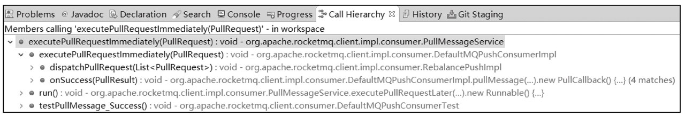

通过跟踪发现，主要有两个地方会调用，
* 一个是在RocketMQ根据PullRequest拉取任务执行完一次消息拉取任务后，又将PullRequest对象放入到pullRequestQueue， 
* 第二个是在RebalancceImpl中创建。RebalanceImpl就是下节重点要介绍的消息队列负载机制，也就是PullRequest对象真正创建的地方.

从上面分析可知，PullMessageService只有在拿到PullRequest对象时才会执行拉取任务，那么PullRequest究竟是什么呢？其类图如图5-4所示.

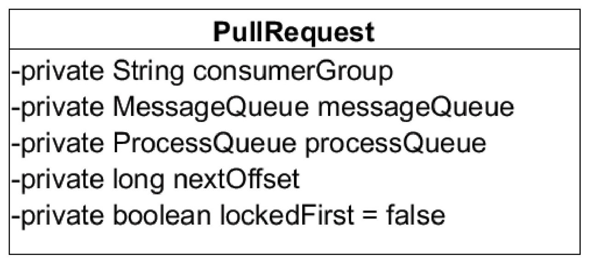

**代码清单5-8 `PullMessageService#pullMessage`**

```java
private void pullMessage(final PullRequest pullRequest) {
    final MQConsumerInner consumer = this.mQClientFactory.selectConsumer(pullRequest.getConsumerGroup());
    if (consumer != null) {
        DefaultMQPushConsumerImpl impl = (DefaultMQPushConsumerImpl) consumer;
        impl.pullMessage(pullRequest);
    } else {
        log.warn("No matched consumer for the PullRequest {}, drop it", pullRequest);
    }
}
```
根据消费组名从MQClientInstance中获取消费者内部实现类MQConsumerInner，令人意外的是这里将consumer强制转换为DefaultMQPushConsumerImpl，

也就是PullMessageService，该线程只为PUSH模式服务，那拉模式如何拉取消息呢？其实细想也不难理解，PULL模式，RocketMQ只需要提供拉取消息API即可，具体由应用程序显示调用拉取API。

###5.4.2 ProcessQueue实现机制

ProcessQueue是MessageQueue在消费端的重现、快照。PullMessageService从消息服务器默认每次拉取32条消息，按消息的队列偏移量顺序存放在ProcessQueue中，PullMessageService然后将消息提交到消费者消费线程池，消息成功消费后从ProcessQueue中移除。ProcessQueue的类图如图5-5所示.

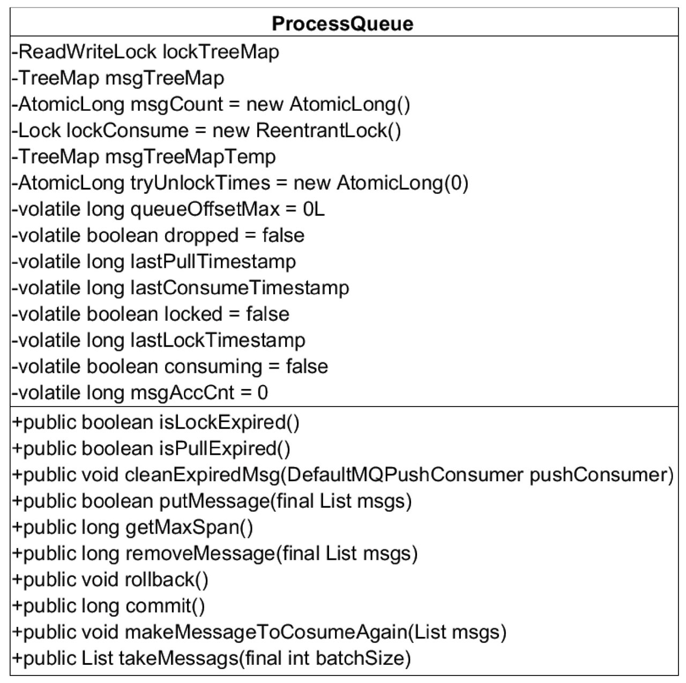


###5.4.3 消息拉取基本流程

本节将以并发消息消费来探讨整个消息消费流程，顺序消息的实现原理将在5.9节中单独分析。
消息拉取分为3个主要步骤。
* 1）消息拉取客户端消息拉取请求封装。
* 2）消息服务器查找并返回消息。
* 3）消息拉取客户端处理返回的消息。

**1．客户端封装消息拉取请求**

消息拉取入口：`DefaultMQPushConsumerImpl#pullMessage`

**2. 消息服务端Broker组装消息**

Brokder端处理消息拉取的入口：`org.apache.rocketmq.broker.processor.PullMessageProcessor#processRequest`

**3．消息拉取客户端处理消息**

回到消息拉取客户端调用入口：`MQClientAPIImpl#pullMessageAsync`

NettyRemotingClient在收到服务端响应结构后会回调PullCallback的onSuccess或onException, PullCallBack对象在DefaultMQPushConsumerImpl#pullMessage中创建.

**RocketMQ消息拉取流程图**


**4．消息拉取长轮询机制分析**

RocketMQ并没有真正实现推模式，而是消费者主动向消息服务器拉取消息，RocketMQ推模式是循环向消息服务端发送消息拉取请求，如果消息消费者向RocketMQ发送消息拉取时，消息并未到达消费队列，如果不启用长轮询机制，则会在服务端等待shortPolling-TimeMills时间后（挂起）再去判断消息是否已到达消息队列，如果消息未到达则提示消息拉取客户端PULL_NOT_FOUND（消息不存在），如果开启长轮询模式，RocketMQ一方面会每5s轮询检查一次消息是否可达，同时一有新消息到达后立马通知挂起线程再次验证新消息是否是自己感兴趣的消息，

如果是则从commitlog文件提取消息返回给消息拉取客户端，否则直到挂起超时，超时时间由消息拉取方在消息拉取时封装在请求参数中，PUSH模式默认为15s, PULL模式通过DefaultMQPullConsumer#setBrokerSuspendMaxTimeMillis设置。RocketMQ通过在Broker端配置longPollingEnable为true来开启长轮询模式。

消息拉取时服务端从Commitlog未找到消息时的处理逻辑如下。

```java
// 未找到消息的处理逻辑，brokerAllowSuspend:broker端是否支持挂起
case ResponseCode.PULL_NOT_FOUND:
// 如果当开启了长轮询机制，PullRequestHoldService线程会每隔5s被唤醒去尝试检测是否有新消息的到来直到超时，如果被挂起，需要等待5s，消息拉取实时性比较差，为了避免这种情况，RocketMQ引入另外一种机制：当消息到达时唤醒挂起线程触发一次检查
if (brokerAllowSuspend && hasSuspendFlag) {
    long pollingTimeMills = suspendTimeoutMillisLong;
    // 是否启用长轮询，如果支持长轮询模式，挂起超时时间来源于请求参数，PUSH模式默认为15s, PULL模式通过DefaultMQPullConsumer#brokerSuspenMaxTimeMillis设置，默认20s。
    // 然后创建拉取任务PullRequest并提交到PullRequestHoldService线程中。
    if (!this.brokerController.getBrokerConfig().isLongPollingEnable()) {
        pollingTimeMills = this.brokerController.getBrokerConfig().getShortPollingTimeMills();
    }

    String topic = requestHeader.getTopic();
    long offset = requestHeader.getQueueOffset();
    int queueId = requestHeader.getQueueId();
    PullRequest pullRequest = new PullRequest(request, channel, pollingTimeMills,
        this.brokerController.getMessageStore().now(), offset, subscriptionData, messageFilter);
    this.brokerController.getPullRequestHoldService().suspendPullRequest(topic, queueId, pullRequest);
    response = null;
    break;
}
```

RocketMQ轮询机制由两个线程共同来完成。
* 1）PullRequestHoldService：每隔5s重试一次。
* 2）DefaultMessageStore#ReputMessageService，每处理一次重新拉取，Thread.sleep（1），继续下一次检查


##5.5 消息队列负载与重新分布机制

PullMessageService在启动时由于LinkedBlockingQueue<PullRequest> pullRequestQueue中没有PullRequest对象，故PullMessageService线程将阻塞。
* 问题1:PullRequest对象在什么时候创建并加入到pullRequestQueue中以便唤醒PullMessageService线程。
   * 解答： RebalanceService线程每隔20s对消费者订阅的主题进行一次队列重新分配，每一次分配都会获取主题的所有队列、从Broker服务器实时查询当前该主题该消费组内消费者列表，对新分配的消息队列会创建对应的PullRequest对象。在一个JVM进程中，同一个消费组同一个队列只会存在一个PullRequest对象
* 问题2：集群内多个消费者是如何负载主题下的多个消费队列，并且如果有新的消费者加入时，消息队列又会如何重新分布。
   * 解答： 由于每次进行队列重新负载时会从Broker实时查询出当前消费组内所有消费者，并且对消息队列、消费者列表进行排序，这样新加入的消费者就会在队列重新分布时分配到消费队列从而消费消息

RocketMQ消息队列重新分布是由RebalanceService线程来实现的。一个MQClientInstance持有一个RebalanceService实现，并随着MQClientInstance的启动而启动。

带着上面两个问题走入RebalanceService#run方法中, 见源码注释

PullMessageService线程与RebalanceService线程交互图

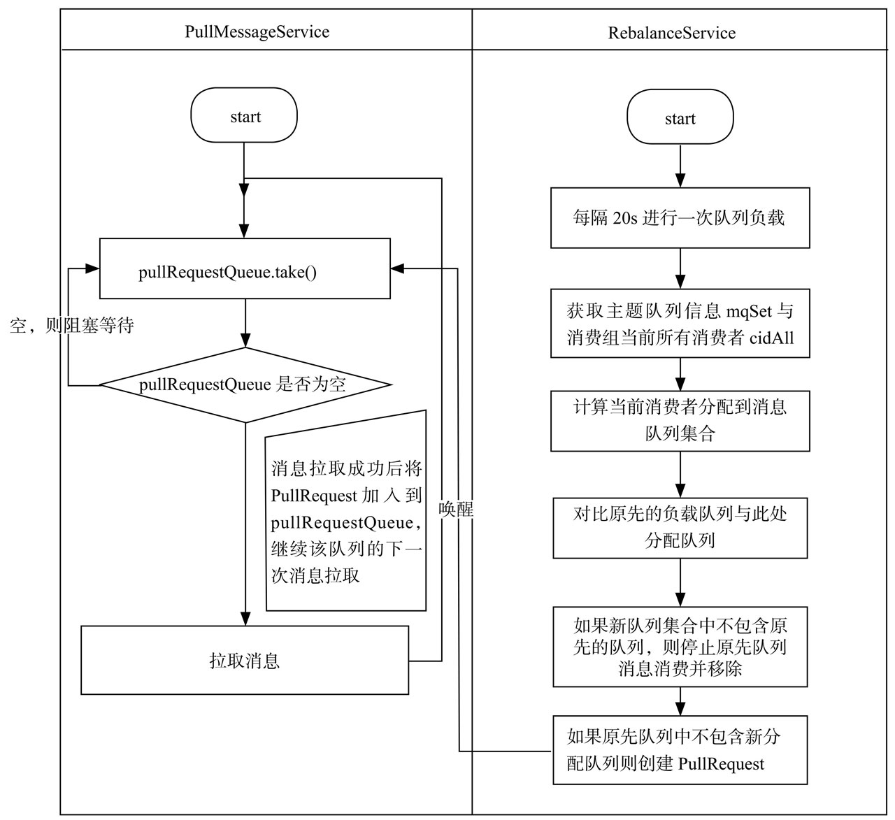


##5.6 消息消费过程

回顾一下消息拉取，PullMessageService负责对消息队列进行消息拉取，从远端服务器拉取消息后将消息存入ProcessQueue消息队列处理队列中，

然后调用`ConsumeMessageService#submitConsumeRequest`方法进行消息消费，使用线程池来消费消息，确保了消息拉取与消息消费的解耦。

RocketMQ使用ConsumeMessageService来实现消息消费的处理逻辑。RocketMQ支持顺序消费与并发消费，本节将重点关注并发消费的消费流程，顺序消费将在5.9节中详细分析。ConsumeMessageService核心类图如图5-11所示。

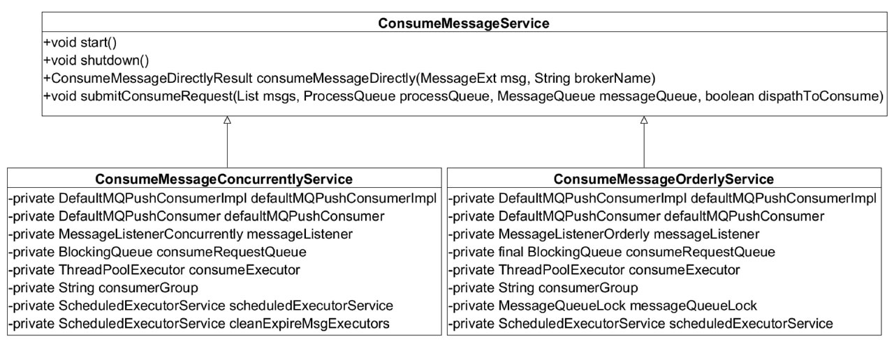

###5.6.1 消息消费

消费者消息消费服务`ConsumeMessageConcurrentlyService`的主要方法是submitConsumeRequest提交消费请求，具体逻辑如源码注释。

###5.6.2 消息确认(ACK)

如果消息监听器返回的消费结果为RECONSUME_LATER，则需要将这些消息发送给Broker延迟消息。如果发送ACK消息失败，将延迟5s后提交线程池进行消费。ACK消息发送的网络客户端入口：MQClientAPIImpl#consumerSendMessageBack，命令编码：RequestCode.CONSUMER_SEND_MSG_BACK。

```java
// 根据消息监听器返回的结果，进行处理
public void processConsumeResult(
    final ConsumeConcurrentlyStatus status,
    final ConsumeConcurrentlyContext context,
    final ConsumeRequest consumeRequest
) {
    int ackIndex = context.getAckIndex();

    if (consumeRequest.getMsgs().isEmpty())
        return;

    // 计算ackIndex
    switch (status) {
        case CONSUME_SUCCESS:
            if (ackIndex >= consumeRequest.getMsgs().size()) {
                ackIndex = consumeRequest.getMsgs().size() - 1;
            }
            int ok = ackIndex + 1;
            int failed = consumeRequest.getMsgs().size() - ok;
            this.getConsumerStatsManager().incConsumeOKTPS(consumerGroup, consumeRequest.getMessageQueue().getTopic(), ok);
            this.getConsumerStatsManager().incConsumeFailedTPS(consumerGroup, consumeRequest.getMessageQueue().getTopic(), failed);
            break;
        case RECONSUME_LATER:
            ackIndex = -1;
            this.getConsumerStatsManager().incConsumeFailedTPS(consumerGroup, consumeRequest.getMessageQueue().getTopic(),
                consumeRequest.getMsgs().size());
            break;
        default:
            break;
    }

    // 如果是广播模式，业务方返回RECONSUME_LATER，消息并不会重新被消费，只是以警告级别输出到日志文件。
    // 如果是集群模式，消息消费成功，由于ackIndex=consumeRequest.getMsgs（）.size（）-1，故i=ackIndex+1等于consumeRequest.getMsgs（）.size（），并不会执行sendMessageBack。
    // 只有在业务方返回RECONSUME_LATER时，该批消息都需要发ACK消息，如果消息发送ACK失败，则直接将本批ACK消费发送失败的消息再次封装为ConsumeRequest，然后延迟5s后重新消费。
    // 如果ACK消息发送成功，则该消息会延迟消费
    switch (this.defaultMQPushConsumer.getMessageModel()) {
        case BROADCASTING:
            for (int i = ackIndex + 1; i < consumeRequest.getMsgs().size(); i++) {
                MessageExt msg = consumeRequest.getMsgs().get(i);
                log.warn("BROADCASTING, the message consume failed, drop it, {}", msg.toString());
            }
            break;
        case CLUSTERING:
            List<MessageExt> msgBackFailed = new ArrayList<MessageExt>(consumeRequest.getMsgs().size());
            for (int i = ackIndex + 1; i < consumeRequest.getMsgs().size(); i++) {
                MessageExt msg = consumeRequest.getMsgs().get(i);
                // 发ACK消息,ACK消息存入CommitLog文件后，将依托RocketMQ定时消息机制在延迟时间到期后再次将消息拉取，提交消费线程池
                boolean result = this.sendMessageBack(msg, context);
                if (!result) {
                    msg.setReconsumeTimes(msg.getReconsumeTimes() + 1);
                    msgBackFailed.add(msg);
                }
            }

            if (!msgBackFailed.isEmpty()) {
                // 移除发送ack失败的消息
                consumeRequest.getMsgs().removeAll(msgBackFailed);
                // ack发送失败的消息再次延迟5s后重新消费
                this.submitConsumeRequestLater(msgBackFailed, consumeRequest.getProcessQueue(), consumeRequest.getMessageQueue());
            }
            break;
        default:
            break;
    }
    // 从ProcessQueue中移除这批消息，这里返回的偏移量是移除该批消息后最小的偏移量，然后用该偏移量更新消息消费进度，以便在消费者重启后能从上一次的消费进度开始消费，避免消息重复消费
    long offset = consumeRequest.getProcessQueue().removeMessage(consumeRequest.getMsgs());
    if (offset >= 0 && !consumeRequest.getProcessQueue().isDropped()) {
        // 消息消费进度存储
        this.defaultMQPushConsumerImpl.getOffsetStore().updateOffset(consumeRequest.getMessageQueue(), offset, true);
    }
}
```
ACK消息存入CommitLog文件后，将依托RocketMQ定时消息机制在延迟时间到期后再次将消息拉取，提交消费线程池，有关定时任务机制将在5.7节详细分析。ACK消息是同步发送的，如果在发送过程中出现错误，将记录所有发送ACK消息失败的消息，然后再次封装成ConsumeRequest，延迟5s执行。

###5.6.3 消费进度管理

消息消费者在消费一批消息后，需要记录该批消息已经消费完毕，否则当消费者重新启动时又得从消息消费队列的开始消费，这显然是不能接受的。从5.6.1节也可以看到，一次消息消费后会从ProceeQueue处理队列中移除该批消息，返回ProceeQueue最小偏移量，并存入消息进度表中。那消息进度文件存储在哪合适呢？
* 广播模式：同一个消费组的所有消息消费者都需要消费主题下的所有消息，也就是同组内的消费者的消息消费行为是对立的，互相不影响，故消息进度需要独立存储，最理想的存储地方应该是与消费者绑定。
* 集群模式：同一个消费组内的所有消息消费者共享消息主题下的所有消息，同一条消息（同一个消息消费队列）在同一时间只会被消费组内的一个消费者消费，并且随着消费队列的动态变化重新负载，所以消费进度需要保存在一个每个消费者都能访问到的地方。

RocketMQ消息消费进度接口如图5-14所示

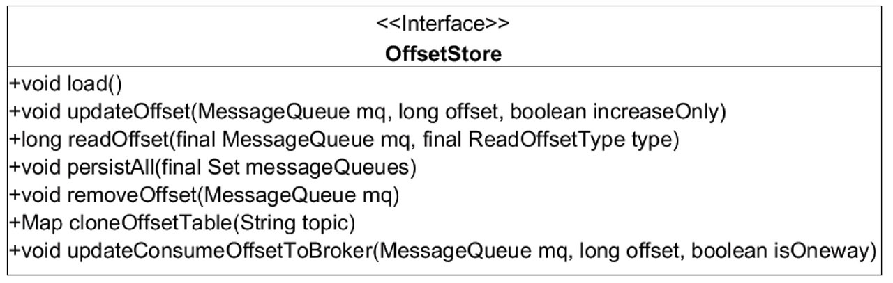

**1．广播模式消费进度存储**

广播模式消息消费进度存储在消费者本地，其实现类`org.apache.rocketmq.client.consu-mer.store.LocalFileOffsetStore`

**2．集群模式消费进度存储**

集群模式消息进度存储文件存放在消息服务端Broker。消息消费进度集群模式实现类：`org.apache.rocketmq.client.consumer.store.RemoteBrokerOffsetStore`

集群模式消息消费进度实现原理图

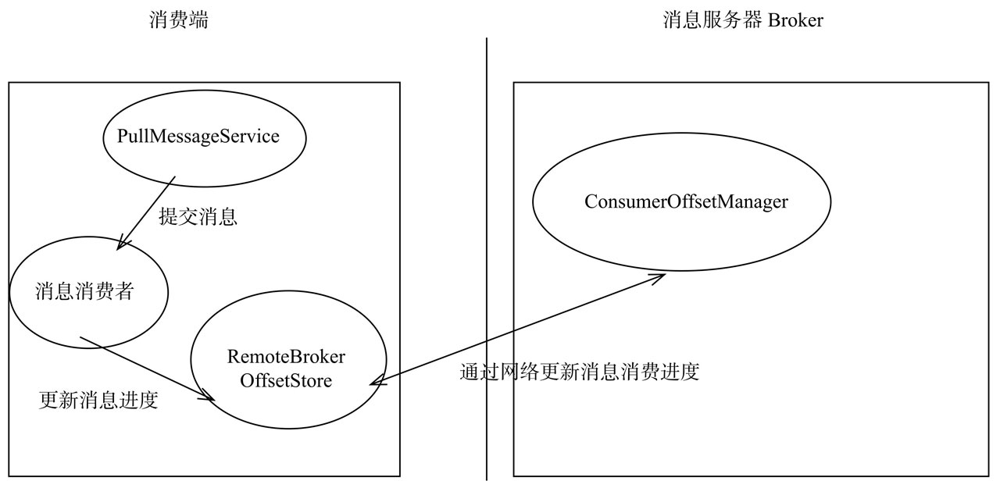

**3．消费进度设计思考**

消息消费进度的存储，广播模式与消费组无关，集群模式下以主题与消费组为键保存该主题所有队列的消费进度。结合并发消息消费的整个流程，思考一下并发消息消费关于消息进度更新的问题，顺序消息消费将在5.9节中重点讨论。
* 1）消费者线程池每处理完一个消息消费任务（ConsumeRequest）时会从ProceeQueue中移除本批消费的消息，并返回ProceeQueue中最小的偏移量，用该偏移量更新消息队列消费进度，也就是说更新消费进度与消费任务中的消息没什么关系。例如现在两个消费任务task1（queueOffset分别为20,40）, task2（50,70），并且ProceeQueue中当前包含最小消息偏移量为10的消息，则task2消费结束后，将使用10去更新消费进度，并不会是70。当task1消费结束后，还是以10去更新消费队列消息进度，消息消费进度的推进取决于ProceeQueue中偏移量最小的消息消费速度。如果偏移量为10的消息消费成功后，假如ProceeQueue中包含消息偏移量为100的消息，则消息偏移量为10的消息消费成功后，将直接用100更新消息消费进度。那如果在消费消息偏移量为10的消息时发送了死锁导致一直无法被消费，那岂不是消息进度无法向前推进。是的，为了避免这种情况，RocketMQ引入了一种消息拉取流控措施：DefaultMQPushConsumer#consumeConcurrentlyMaxSp-an=2000，消息处理队列ProceeQueue中最大消息偏移与最小偏移量不能超过该值，如超过该值，触发流控，将延迟该消息队列的消息拉取。
* 2）触发消息消费进度更新的另外一个是在进行消息负载时，如果消息消费队列被分配给其他消费者时，此时会将该ProceeQueue状态设置为droped，持久化该消息队列的消费进度，并从内存中移除。

##5.7 定时消息机制

定时消息是指消息发送到Broker后，并不立即被消费者消费而是要等到特定的时间后才能被消费，RocketMQ并不支持任意的时间精度，如果要支持任意时间精度的定时调度，不可避免地需要在Broker层做消息排序（可以参考JDK并发包调度线程池ScheduledExecutorService的实现原理），再加上持久化方面的考量，将不可避免地带来具大的性能消耗，所以RocketMQ只支持特定级别的延迟消息。

消息延迟级别在Broker端通过messageDelayLevel配置，默认为"1s 5s 10s 30s 1m 2m 3m 4m 5m 6m 7m 8m 9m 10m 20m 30m 1h 2h", delayLevel=1表示延迟1s, delayLevel=2表示延迟5s，依次类推。

说到定时任务，上文提到的消息重试正是借助定时任务实现的，在将消息存入commitlog文件之前需要判断消息的重试次数，如果大于0，则会将消息的主题设置为SCHEDULE_TOPIC_XXXX。

RocketMQ定时消息实现类为`org.apache.rocketmq.store.schedule.ScheduleMessageService`。该类的实例在DefaultMessageStore中创建，通过在DefaultMessageStore中调用load方法加载并调用start方法进行启动。接下来我们分析一下ScheduleMessageService实现原理。

定时消息的第一个设计关键点是，定时消息单独一个主题：SCHEDULE_TOPIC_XXXX，该主题下队列数量等于MessageStoreConfig#messageDelayLevel配置的延迟级别数量，其对应关系为queueId等于延迟级别减1。ScheduleMessageService为每一个延迟级别创建一个定时Timer根据延迟级别对应的延迟时间进行延迟调度。在消息发送时，如果消息的延迟级别delayLevel大于0，将消息的原主题名称、队列ID存入消息的属性中，然后改变消息的主题、队列与延迟主题与延迟主题所属队列，消息将最终转发到延迟队列的消费队列。

ScheduleMessageService的start方法启动后，会为每一个延迟级别创建一个调度任务，每一个延迟级别其实对应SCHEDULE_TOPIC_XXXX主题下的一个消息消费队列。定时调度任务的实现类为DeliverDelayedMessageTimerTask，其核心实现为executeOnTimeup。

定时消息的第二个设计关键点：消息存储时如果消息的延迟级别属性delayLevel大于0，则会备份原主题、原队列到消息属性中，其键分别为PROPERTY_REAL_TOPIC、PROPERTY_REAL_QUEUE_ID，通过为不同的延迟级别创建不同的调度任务，当时间到达后执行调度任务，调度任务主要就是根据延迟拉取消息消费进度从延迟队列中拉取消息，然后从commitlog中加载完整消息，清除延迟级别属性并恢复原先的主题、队列，再次创建一条新的消息存入到commitlog中并转发到消息消费队列供消息消费者消费。

**定时消息实现流程图**

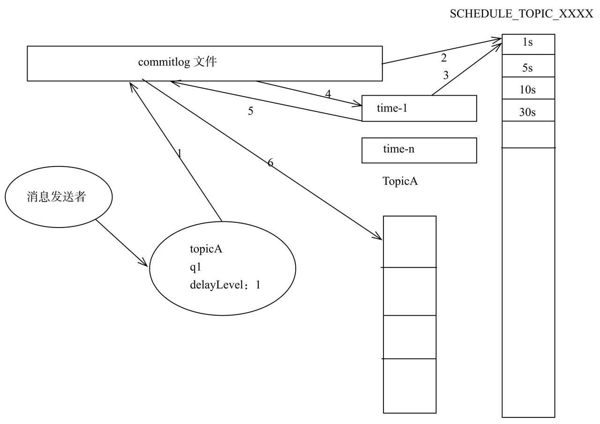

* 1）消息消费者发送消息，如果发送消息的delayLevel大于0，则改变消息主题为SCHEDULE_TOPIC_XXXX，消息队列为delayLevel减1。
* 2）消息经由commitlog转发到消息消费队列SCHEDULE_TOPIC_XXXX的消息消费队列0。
* 3）定时任务Time每隔1s根据上次拉取偏移量从消费队列中取出所有消息。
* 4）根据消息的物理偏移量与消息大小从CommitLog中拉取消息。
* 5）根据消息属性重新创建消息，并恢复原主题topicA、原队列ID，清除delayLevel属性，存入commitlog文件。
* 6）转发到原主题topicA的消息消费队列，供消息消费者消费

##5.8 消息过滤机制

RocketMQ支持表达式过滤与类过滤两种模式，
* 其中表达式又分为TAG和SQL92。
* 类过滤模式允许提交一个过滤类到FilterServer，消息消费者从FilterServer拉取消息，消息经过FilterServer时会执行过滤逻辑。

表达式模式分为TAG与SQL92表达式，SQL92表达式以消息属性过滤上下文，实现SQL条件过滤表达式而TAG模式就是简单为消息定义标签，根据消息属性tag进行匹配。消息过滤API如图5-21所示

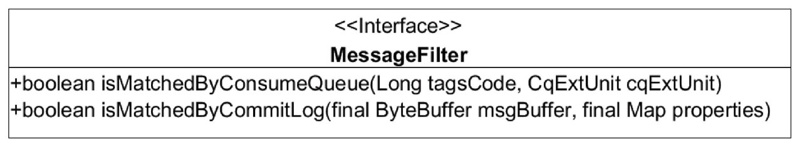

消息发送者在消息发送时如果设置了消息的tags属性，存储在消息属性中，先存储在CommitLog文件中，然后转发到消息消费队列，消息消费队列会用8个字节存储消息tag的hashcode，之所以不直接存储tag字符串，是因为将ConumeQueue设计为定长结构，加快消息消费的加载性能。

在Broker端拉取消息时，遍历ConsumeQueue，只对比消息tag的hashcode，如果匹配则返回，否则忽略该消息。Consume在收到消息后，同样需要先对消息进行过滤，只是此时比较的是消息tag的值而不再是hashcode。

接下来从源码的角度探究RocketMQ是如何实现的, 见`DefaultMQPushConsumerImpl#subscribe`，`DefaultMQPushConsumerImpl#pullMessage`, `PullMessageProcessor#processRequest`，`DefaultMessageStore#getMessage`，`PullAPIWrapper#processPullResult` 源码注释。

##5.9 顺序消息

RocketMQ支持局部消息顺序消费，可以确保同一个消息消费队列中的消息被顺序消费，如果需要做到全局顺序消费则可以将主题配置成一个队列，例如数据库BinLog等要求严格顺序的场景。根据并发消息消费的流程，消息消费包含如下4个步骤：消息队列负载、消息拉取、消息消费、消息消费进度存储。

###5.9.1 消息队列负载

RocketMQ首先需要通过RebalanceService线程实现消息队列的负载，集群模式下同一个消费组内的消费者共同承担其订阅主题下消息队列的消费，同一个消息消费队列在同一时刻只会被消费组内一个消费者消费，一个消费者同一时刻可以分配多个消费队列。

代码清单5-85 `RebalanceImpl#updateProcessQueueTableInRebalance`

```java
private boolean updateProcessQueueTableInRebalance(final String topic, final Set<MessageQueue> mqSet,
final boolean isOrder) {
boolean changed = false;

Iterator<Entry<MessageQueue, ProcessQueue>> it = this.processQueueTable.entrySet().iterator();
while (it.hasNext()) {
    Entry<MessageQueue, ProcessQueue> next = it.next();
    MessageQueue mq = next.getKey();
    ProcessQueue pq = next.getValue();
    if (mq.getTopic().equals(topic)) {
        
}
    ///省略部分代码
}
```
如果经过消息队列重新负载（分配）后，分配到新的消息队列时，首先需要尝试向Broker发起锁定该消息队列的请求，如果返回加锁成功则创建该消息队列的拉取任务，否则将跳过，等待其他消费者释放该消息队列的锁，然后在下一次队列重新负载时再尝试加锁。加锁逻辑在下文重点介绍。

```xml
顺序消息消费与并发消息消费的第一个关键区别：顺序消息在创建消息队列拉取任务时需要在Broker服务器锁定该消息队列
```

###5.9.2 消息拉取

RocketMQ消息拉取由PullMessageService线程负责，根据消息拉取任务循环拉取消息。

代码清单5-86 `DefaultMQPushConsumerImpl#pullMessage`

```java
// 顺序消息拉取，如果处理队列被锁定
if (processQueue.isLocked()) {
    // 如果该处理队列是第一次拉取任务，则首先计算拉取偏移量，然后向消息服务端拉取消息。
    if (!pullRequest.isPreviouslyLocked()) {
        long offset = -1L;
        try {
            offset = this.rebalanceImpl.computePullFromWhereWithException(pullRequest.getMessageQueue());
        } catch (Exception e) {
            this.executePullRequestLater(pullRequest, pullTimeDelayMillsWhenException);
            log.error("Failed to compute pull offset, pullResult: {}", pullRequest, e);
            return;
        }
        boolean brokerBusy = offset < pullRequest.getNextOffset();
        log.info("the first time to pull message, so fix offset from broker. pullRequest: {} NewOffset: {} brokerBusy: {}",
            pullRequest, offset, brokerBusy);
        if (brokerBusy) {
            log.info("[NOTIFYME]the first time to pull message, but pull request offset larger than broker consume offset. pullRequest: {} NewOffset: {}",
                pullRequest, offset);
        }

        pullRequest.setPreviouslyLocked(true);
        pullRequest.setNextOffset(offset);
    }
} else {
    // 如果消息处理队列未被锁定，则延迟3s后再将pullrequest对象放入到拉取任务中
    this.executePullRequestLater(pullRequest, pullTimeDelayMillsWhenException);
    log.info("pull message later because not locked in broker, {}", pullRequest);
    return;
}
```
如果消息处理队列未被锁定，则延迟3s后再将PullRequest对象放入到拉取任务中，如果该处理队列是第一次拉取任务，则首先计算拉取偏移量，然后向消息服务端拉取消息.

###5.9.3 消息消费

顺序消息消费的实现类：`org.apache.rocketmq.client.impl.consumer.ConsumeMessageOrderlyService`

见源码注释`ConsumeMessageOrderlyService#start` ，`RebalanceImpl#buildProcessQueueTableByBrokerName`，`RebalanceImpl#lockAll`， `ConsumeMessageOrderlyService#submitConsumeRequest
`，`ConsumeMessageOrderlyService$ConsumeRequest#run`，`ConsumeMessageOrderlyService#processConsumeResult`

###5.9.4 消息队列锁实现

顺序消息消费的各个环节基本都是围绕消息消费队列（MessageQueue）与消息处理队列（ProceeQueue）展开的。消息消费进度拉取，消息进度消费都要判断ProceeQueue的locked是否为true，设置ProceeQueue为true的前提条件是消息消费者（cid）向Broker端发送锁定消息队列的请求并返回加锁成功。

服务端关于MessageQueue加锁处理类：`org.apache.rocketmq.broker.client.rebalance.RebalanceLockManager`。类图如图5-26所示.

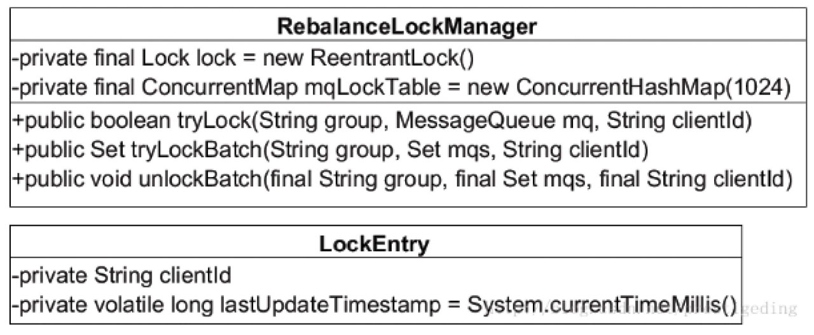


##5.10 本章小结

本章主要介绍了消息消费的实现细节。其主要关注点包括消息消费方式、消息队列负载、消息拉取、消息消费、消息消费进度存储、消息过滤、定时消息、顺序消息。

RocketMQ消息消费方式分别为集群模式与广播模式、集群模式。

消息队列负载由RebalanceService线程默认每隔20s进行一次消息队列负载，根据当前消费组内消费者个数与主题队列数量按照某一种负载算法进行队列分配，分配原则为同一个消费者可以分配多个消息消费队列，同一个消息消费队列同一时间只会分配给一个消费者。

消息拉取由PullMessageService线程根据RebalanceService线程创建的拉取任务进行拉取，默认一批拉取32条消息，提交给消费者消费线程池后继续下一次的消息拉取。如果消息消费过慢产生消息堆积会触发消息消费拉取流控。

并发消息消费指消费线程池中的线程可以并发地对同一个消息消费队列的消息进行消费，消费成功后，取出消息处理队列中最小的消息偏移量作为消息消费进度偏移量存在于消息消费进度存储文件中，集群模式消息进度存储在Broker（消息服务器），广播模式消息进度存储在消费者端。如果业务方返回RECONSUME_LATER，则RocketMQ启用消息消费重试机制，将原消息的主题与队列存储在消息属性中，将消息存储在主题名为SCHEDULE_TOPIC_XXXX的消息消费队列中，等待指定时间后，RocketMQ将自动将该消息重新拉取并再次将消息存储在commitlog进而转发到原主要的消息消费队列供消费者消费，消息消费重试主题为%RETRY%消费者组名。

RocketMQ不支持任意精度的定时调度消息，只支持自定义的消息延迟级别，例如1s 2s 5s等，可通过在broker配置文件中设置messageDelayLevel。其实现原理是RocketMQ为这些延迟级别定义对应的消息消费队列，其主题为SCHEDULE_TOPIC_XXXX，然后创建对应延迟级别的定时任务从消息消费队列中将消息拉取并恢复消息的原主题与原消息消费队列再次存入commitlog文件并转发到相应的消息消费队列以便消息消费者拉取消息并消费。

RocketMQ消息消费支持表达式与类过滤模式，本章重点分析了基于表达式的消息过滤，其中表达式消息过滤又分为基于TAG模式与SQL92表达式，TAG模式就是为消息设定一个TAG，然后消息消费者订阅TAG，如果消费者订阅的TAG列表包含消息的TAG则消费该消息。SQL92表达式基于消息属性实现SQL条件表达式的过滤模式。

顺序消息消费一般使用集群模式，是指消息消费者内的线程池中的线程对消息消费队列只能串行消费。与并发消息消费最本质的区别是消费消息时必须成功锁定消息消费队列，在Broker端会存储消息消费队列的锁占用情况。


