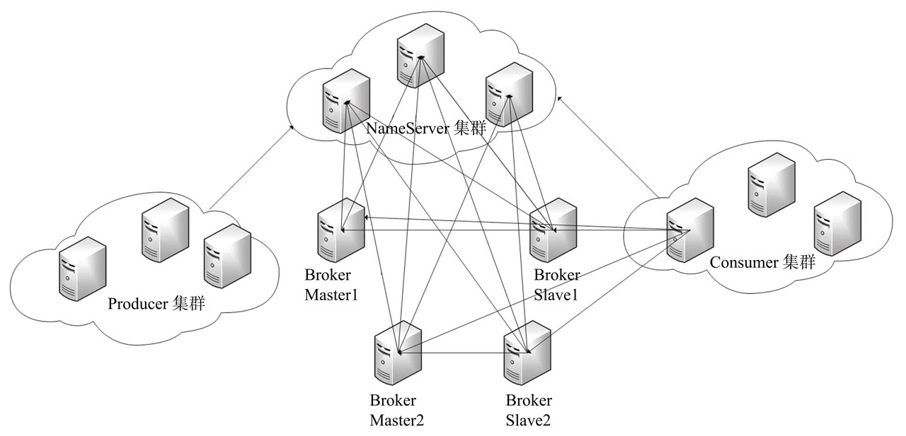
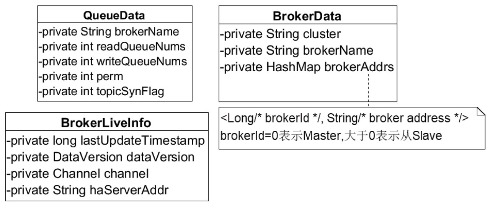
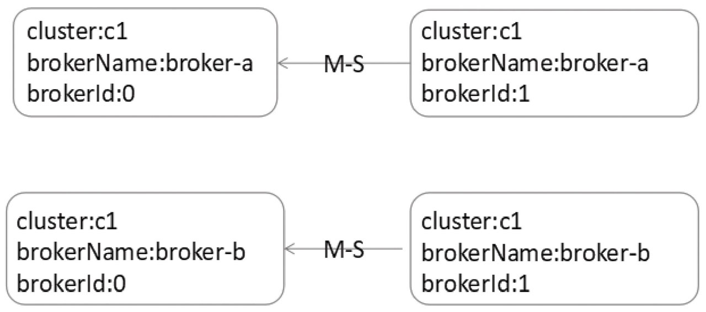
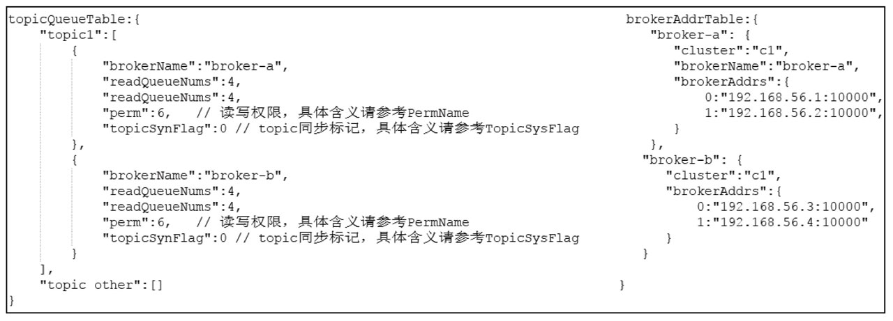
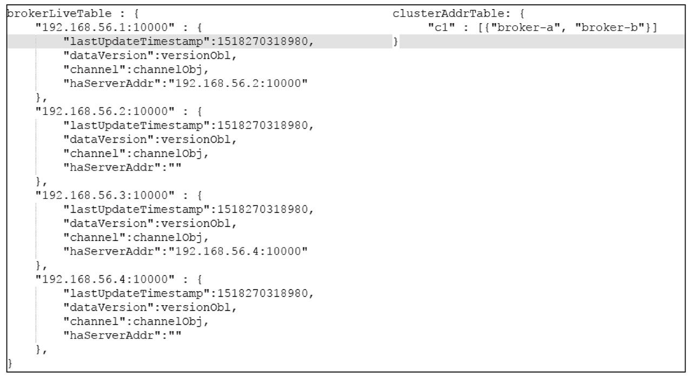
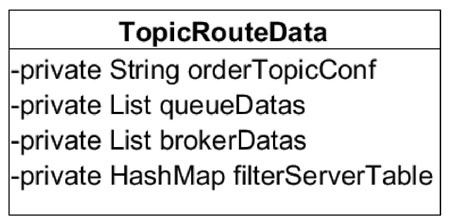
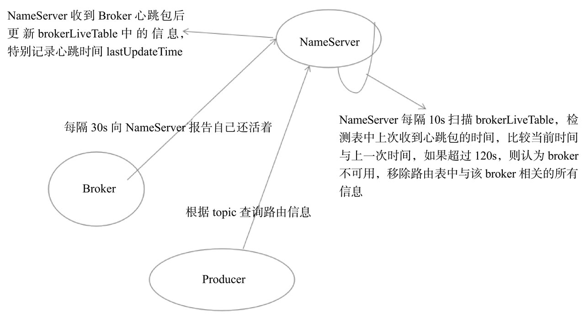

#RocketMQ路由中心NameServer

##2.1 NameServer架构设计
消息中间件的设计思路一般基于主题的订阅发布机制，消息生产者（Producer）发送某一主题的消息到消息服务器，消息服务器负责该消息的持久化存储，消息消费者（Consumer）订阅感兴趣的主题，消息服务器根据订阅信息（路由信息）将消息推送到消费者（PUSH模式）或者消息消费者主动向消息服务器拉取消息（PULL模式），从而实现消息生产者与消息消费者解耦。

为了避免消息服务器的单点故障导致的整个系统瘫痪，通常会部署多台消息服务器共同承担消息的存储。那消息生产者如何知道消息要发往哪台消息服务器呢？如果某一台消息服务器宕机了，那么生产者如何在不重启服务的情况下感知呢？NameServer就是为了解决上述问题而设计的。

RocketMQ的逻辑部署图如图2-1所示:


Broker消息服务器在启动时向所有NameServer注册，消息生产者（Producer）在发送消息之前先从NameServer获取Broker服务器地址列表，然后根据负载算法从列表中选择一台消息服务器进行消息发送。

NameServer与每台Broker服务器保持长连接，并间隔30s检测Broker是否存活，如果检测到Broker宕机，则从路由注册表中将其移除。但是路由变化不会马上通知消息生产者,为什么要这样设计呢？

这是为了降低NameServer实现的复杂性，在消息发送端提供容错机制来保证消息发送的高可用性

NameServer本身的高可用可通过部署多台NameServer服务器来实现，但彼此之间互不通信，也就是NameServer服务器之间在某一时刻的数据并不会完全相同，但这对消息发送不会造成任何影响，这也是RocketMQ NameServer设计的一个亮点，RocketMQ NameServer设计追求简单高效。

##2.2 NameServer启动流程
从源码的角度窥探一下NameServer启动流程，重点关注NameServer相关启动参数。

NameServer启动类：`org.apache.rocketmq.namesrv.NamesrvStartup`

###Step1：首先来解析配置文件，需要填充NameServerConfig、NettyServerConfig属性值。

```java
final NamesrvConfig namesrvConfig = new NamesrvConfig();
final NettyServerConfig nettyServerConfig = new NettyServerConfig();
nettyServerConfig.setListenPort(9876);
if (commandLine.hasOption('c')) {
    String file = commandLine.getOptionValue('c');
    if (file != null) {
        InputStream in = new BufferedInputStream(new FileInputStream(file));
        properties = new Properties();
        properties.load(in);
        MixAll.properties2Object(properties, namesrvConfig);
        MixAll.properties2Object(properties, nettyServerConfig);

        namesrvConfig.setConfigStorePath(file);

        System.out.printf("load config properties file OK, %s%n", file);
        in.close();
    }
}

if (commandLine.hasOption('p')) {
    InternalLogger console = InternalLoggerFactory.getLogger(LoggerName.NAMESRV_CONSOLE_NAME);
    MixAll.printObjectProperties(console, namesrvConfig);
    MixAll.printObjectProperties(console, nettyServerConfig);
    System.exit(0);
}

MixAll.properties2Object(ServerUtil.commandLine2Properties(commandLine), namesrvConfig);
```

从代码我们可以知道先创建NameSrvConfig（NameServer业务参数）、NettyServerConfig（NameServer网络参数），然后在解析启动时把指定的配置文件或启动命令中的选项值，填充到nameSrvConfig, nettyServerConfig对象。参数来源有如下两种方式.

*  1）-c configFile通过-c命令指定配置文件的路径
*  2）使用“--属性名 属性值”，例如 --listenPort 9876

**代码清单2-2 NameSrvConfig属性**
```java
private String rocketmqHome = System.getProperty(MixAll.ROCKETMQ_HOME_PROPERTY, System.getenv(MixAll.ROCKETMQ_HOME_ENV));
private String kvConfigPath = System.getProperty("user.home") + File.separator + "namesrv" + File.separator + "kvConfig.json";
private String configStorePath = System.getProperty("user.home") + File.separator + "namesrv" + File.separator + "namesrv.properties";
private String productEnvName = "center";
private boolean clusterTest = false;
private boolean orderMessageEnable = false;
```

*  rocketmqhome: rocketmq主目录，可以通过-Drocketmq.home.dir=path或通过设置环境变量ROCKETMQ_HOME来配置RocketMQ的主目录。
*  kvConfigPath:NameServer存储KV配置属性的持久化路径。
*  configStorePath:nameServer默认配置文件路径，不生效。nameServer启动时如果要通过配置文件配置NameServer启动属性的话，请使用-c选项。
*  orderMessageEnable：是否支持顺序消息，默认是不支持

**代码清单2-3 NettyServerConfig属性**
```java
private int listenPort = 8888;
private int serverWorkerThreads = 8;
private int serverCallbackExecutorThreads = 0;
private int serverSelectorThreads = 3;
private int serverOnewaySemaphoreValue = 256;
private int serverAsyncSemaphoreValue = 64;
private int serverChannelMaxIdleTimeSeconds = 120;
private int serverSocketSndBufSize = NettySystemConfig.socketSndbufSize;
private int serverSocketRcvBufSize = NettySystemConfig.socketRcvbufSize;
private int writeBufferHighWaterMark = NettySystemConfig.writeBufferHighWaterMark;
private int writeBufferLowWaterMark = NettySystemConfig.writeBufferLowWaterMark;
private int serverSocketBacklog = NettySystemConfig.socketBacklog;
private boolean serverPooledByteBufAllocatorEnable = true;
private boolean useEpollNativeSelector = false;
```
*  listenPort:NameServer监听端口，该值默认会被初始化为9876。
*  serverWorkerThreads:Netty业务线程池线程个数。
*  serverCallbackExecutorThreads:Netty public任务线程池线程个数，Netty网络设计，根据业务类型会创建不同的线程池，比如处理消息发送、消息消费、心跳检测等。如果该业务类型（RequestCode）未注册线程池，则由public线程池执行。
*  serverSelectorThreads:IO线程池线程个数，主要是NameServer、Broker端解析请求、返回相应的线程个数，这类线程主要是处理网络请求的，解析请求包，然后转发到各个业务线程池完成具体的业务操作，然后将结果再返回调用方。
*  serverOnewaySemaphoreValue:send oneway消息请求并发度（Broker端参数）。
*  serverAsyncSemaphoreValue：异步消息发送最大并发度（Broker端参数）。
*  serverChannelMaxIdleTimeSeconds：网络连接最大空闲时间，默认120s。如果连接空闲时间超过该参数设置的值，连接将被关闭。
*  serverSocketSndBufSize：网络socket发送缓存区大小，默认64k。
*  serverSocketRcvBufSize：网络socket接收缓存区大小，默认64k。
*  serverPooledByteBufAllocatorEnable:ByteBuffer是否开启缓存，建议开启。
*  useEpollNativeSelector：是否启用Epoll IO模型，Linux环境建议开启。

###Step2：根据启动属性创建NamesrvController实例，并初始化该实例，NameServerController实例为NameServer核心控制器

**代码清单2-4 NamesrvController#Initialize代码片段**
```java
public boolean initialize() {
this.kvConfigManager.load();
this.remotingServer = new NettyRemotingServer(this.nettyServerConfig, this.brokerHousekeepingService);
this.remotingExecutor =
    Executors.newFixedThreadPool(nettyServerConfig.getServerWorkerThreads(), new ThreadFactoryImpl("RemotingExecutorThread_"));
this.registerProcessor();

this.scheduledExecutorService.scheduleAtFixedRate(new Runnable() {
    @Override
    public void run() {
        NamesrvController.this.routeInfoManager.scanNotActiveBroker();
    }
}, 5, 10, TimeUnit.SECONDS);

this.scheduledExecutorService.scheduleAtFixedRate(new Runnable() {
    @Override
    public void run() {
        NamesrvController.this.kvConfigManager.printAllPeriodically();
    }
}, 1, 10, TimeUnit.MINUTES);

return true;
}
```
加载KV配置，创建NettyServer网络处理对象，然后开启两个定时任务，在RocketMQ中此类定时任务统称为心跳检测。
*  定时任务1:NameServer每隔10s扫描一次Broker，移除处于不激活状态的Broker。
*  定时任务2:nameServer每隔10分钟打印一次KV配置

###Step3：注册JVM钩子函数并启动服务器，以便监听Broker、消息生产者的网络请求

**代码清单2-5 注册JVM钩子函数代码**
```java
Runtime.getRuntime().addShutdownHook(new ShutdownHookThread(log, new Callable<Void>() {
@Override
public Void call() throws Exception {
    controller.shutdown();
    return null;
}
}));

controller.start();
```
这里主要是向读者展示一种常用的编程技巧，如果代码中使用了线程池，一种优雅停机的方式就是注册一个JVM钩子函数，在JVM进程关闭之前，先将线程池关闭，及时释放资源

##2.3 NameServer路由注册、故障剔除
NameServer主要作用是为消息生产者和消息消费者提供关于主题Topic的路由信息，那么NameServer需要存储路由的基础信息，还要能够管理Broker节点，包括路由注册、路由删除等功能。

###2.3.1 路由元信息
NameServer路由实现类：`org.apache.rocketmq.namesrv.routeinfo.RouteInfoManager`，在了解路由注册之前，我们首先看一下NameServer到底存储哪些信息。

**代码清单2-6 RouteInfoManager路由元数据**
```java
private final HashMap<String/* topic */, List<QueueData>> topicQueueTable;
private final HashMap<String/* brokerName */, BrokerData> brokerAddrTable;
private final HashMap<String/* clusterName */, Set<String/* brokerName */>> clusterAddrTable;
private final HashMap<String/* brokerAddr */, BrokerLiveInfo> brokerLiveTable;
private final HashMap<String/* brokerAddr */, List<String>/* Filter Server */> filterServerTable;
```
*  topicQueueTable:Topic消息队列路由信息，消息发送时根据路由表进行负载均衡。
*  brokerAddrTable:Broker基础信息，包含brokerName、所属集群名称、主备Broker地址。
*  clusterAddrTable:Broker集群信息，存储集群中所有Broker名称。
*  brokerLiveTable:Broker状态信息。NameServer每次收到心跳包时会替换该信息。
*  filterServerTable:Broker上的FilterServer列表，用于类模式消息过滤，详细介绍请参考第6章的内容

**QueueData、BrokerData、BrokerLiveInfo类图如图2-2所示**



```xml
RocketMQ基于订阅发布机制，一个Topic拥有多个消息队列，一个Broker为每一主题默认创建4个读队列4个写队列。
多个Broker组成一个集群，BrokerName由相同的多台Broker组成Master-Slave架构，brokerId为0代表Master，大于0表示Slave。
BrokerLiveInfo中的lastUpdateTimestamp存储上次收到Broker心跳包的时间
```

**RocketMQ2主2从部署图如图2-3所示**



**对应TopicQueueTable、brokerAddrTable运行时内存结构**



**BrokerLiveTable、clusterAddrTable运行时内存结构**



###2.3.2 路由注册

RocketMQ路由注册是通过Broker与NameServer的心跳功能实现的。Broker启动时向集群中所有的NameServer发送心跳语句，每隔30s向集群中所有NameServer发送心跳包，NameServer收到Broker心跳包时会更新brokerLiveTable缓存中BrokerLiveInfo的lastUpdate Timestamp，然后Name Server每隔10s扫描brokerLiveTable，如果连续120s没有收到心跳包，NameServer将移除该Broker的路由信息同时关闭Socket连接。

####1．Broker发送心跳包

Broker发送心跳包的核心代码如下所示。

**代码清单2-7 Broker端心跳包发送（BrokerController#start）**
```java
this.scheduledExecutorService.scheduleAtFixedRate(new Runnable() {

    @Override
    public void run() {
        try {
            BrokerController.this.registerBrokerAll(true, false, brokerConfig.isForceRegister());
        } catch (Throwable e) {
            log.error("registerBrokerAll Exception", e);
        }
    }
}, 1000 * 10, Math.max(10000, Math.min(brokerConfig.getRegisterNameServerPeriod(), 60000)), TimeUnit.MILLISECONDS);
```
**代码清单2-8 BrokerOuterAPI#registerBrokerAll**

```java
List<String> nameServerAddressList = this.remotingClient.getNameServerAddressList();
if (nameServerAddressList != null && nameServerAddressList.size() > 0) {
    final RegisterBrokerRequestHeader requestHeader = new RegisterBrokerRequestHeader();
    requestHeader.setBrokerAddr(brokerAddr);
    requestHeader.setBrokerId(brokerId);
    requestHeader.setBrokerName(brokerName);
    requestHeader.setClusterName(clusterName);
    requestHeader.setHaServerAddr(haServerAddr);
    requestHeader.setCompressed(compressed);

    RegisterBrokerBody requestBody = new RegisterBrokerBody();
    requestBody.setTopicConfigSerializeWrapper(topicConfigWrapper);
    requestBody.setFilterServerList(filterServerList);
    final byte[] body = requestBody.encode(compressed);
    final int bodyCrc32 = UtilAll.crc32(body);
    requestHeader.setBodyCrc32(bodyCrc32);
    final CountDownLatch countDownLatch = new CountDownLatch(nameServerAddressList.size());
    for (final String namesrvAddr : nameServerAddressList) {
        brokerOuterExecutor.execute(new Runnable() {
            @Override
            public void run() {
                try {
                    RegisterBrokerResult result = registerBroker(namesrvAddr, oneway, timeoutMills, requestHeader, body);
                    if (result != null) {
                        registerBrokerResultList.add(result);
                    }

                    log.info("register broker[{}]to name server {} OK", brokerId, namesrvAddr);
                } catch (Exception e) {
                    log.warn("registerBroker Exception, {}", namesrvAddr, e);
                } finally {
                    countDownLatch.countDown();
                }
            }
        });
    }

    try {
        countDownLatch.await(timeoutMills, TimeUnit.MILLISECONDS);
    } catch (InterruptedException e) {
    }
}
```
该方法主要是遍历NameServer列表，Broker消息服务器依次向NameServer发送心跳包。

**代码清单2-9 BrokerOuterAPI#registerBroker（网络发送代码）**

```java
RemotingCommand request = RemotingCommand.createRequestCommand(RequestCode.REGISTER_BROKER, requestHeader);
request.setBody(body);

if (oneway) {
    try {
        this.remotingClient.invokeOneway(namesrvAddr, request, timeoutMills);
    } catch (RemotingTooMuchRequestException e) {
        // Ignore
    }
    return null;
}

RemotingCommand response = this.remotingClient.invokeSync(namesrvAddr, request, timeoutMills);
```
发送心跳包具体逻辑，首先封装请求包头（Header）。
*  brokerAddr:broker地址。
*  brokerId:brokerId,0:Master；大于0:Slave。
*  brokerName:broker名称。
*  clusterName：集群名称。
*  haServerAddr:master地址，初次请求时该值为空，slave向Nameserver注册后返回。
*  requestBody：
   * filterServerList。消息过滤服务器列表。
   * topicConfigWrapper。主题配置,topicConfigWrapper内部封装的是TopicConfigManager中的topicConfigTable，内部存储的是Broker启动时默认的一些Topic
    
```xml
RocketMQ网络传输基于Netty，具体网络实现细节本书不会过细去剖析，
在这里介绍一下网络跟踪方法：每一个请求，RocketMQ都会定义一个RequestCode，
然后在服务端会对应相应的网络处理器（processor包中），
只需整库搜索RequestCode即可找到相应的处理逻辑。
如果对Netty感兴趣，可以参考笔者发布的《源码研究Netty系列》[http://blog.csdn.net/column/details/15042.html]。
```

####2．NameServer处理心跳包

`org.apache.rocketmq.namesrv.processor.DefaultRequestProcessor`网络处理器解析请求类型，
如果请求类型为RequestCode.REGISTER_BROKER，则请求最终转发到RouteInfoManager#registerBroker

**代码清单2-10 RouteInfoManager#registerBroker的 clusterAddrTable维护**
```java
this.lock.writeLock().lockInterruptibly();

Set<String> brokerNames = this.clusterAddrTable.get(clusterName);
if (null == brokerNames) {
    brokerNames = new HashSet<String>();
    this.clusterAddrTable.put(clusterName, brokerNames);
}
brokerNames.add(brokerName);
```
Step1：路由注册需要加写锁，防止并发修改RouteInfoManager中的路由表。首先判断Broker所属集群是否存在，如果不存在，则创建，然后将broker名加入到集群Broker集合中

**代码清单2-11 RouteInfoManager#registerBroker的 brokerAddrTable维护**
```java
BrokerData brokerData = this.brokerAddrTable.get(brokerName);
if (null == brokerData) {
    registerFirst = true;
    brokerData = new BrokerData(clusterName, brokerName, new HashMap<Long, String>());
    this.brokerAddrTable.put(brokerName, brokerData);
}
Map<Long, String> brokerAddrsMap = brokerData.getBrokerAddrs();
Iterator<Entry<Long, String>> it = brokerAddrsMap.entrySet().iterator();
while (it.hasNext()) {
    Entry<Long, String> item = it.next();
    if (null != brokerAddr && brokerAddr.equals(item.getValue()) && brokerId != item.getKey()) {
        it.remove();
    }
}

String oldAddr = brokerData.getBrokerAddrs().put(brokerId, brokerAddr);
registerFirst = registerFirst || (null == oldAddr);
```
Step2：维护BrokerData信息，首先从brokerAddrTable根据BrokerName尝试获取Broker信息，如果不存在，则新建BrokerData并放入到brokerAddrTable, registerFirst设置为true；如果存在，直接替换原先的，registerFirst设置为false，表示非第一次注册

**代码清单2-12 RouteInfoManager#registerBroker的 topicQueueTable维护**
```java
if (null != topicConfigWrapper
    && MixAll.MASTER_ID == brokerId) {
    if (this.isBrokerTopicConfigChanged(brokerAddr, topicConfigWrapper.getDataVersion())
        || registerFirst) {
        ConcurrentMap<String, TopicConfig> tcTable =
            topicConfigWrapper.getTopicConfigTable();
        if (tcTable != null) {
            for (Map.Entry<String, TopicConfig> entry : tcTable.entrySet()) {
                this.createAndUpdateQueueData(brokerName, entry.getValue());
            }
        }
    }
}
```
Step3：如果Broker为Master，并且Broker Topic配置信息发生变化或者是初次注册，则需要创建或更新Topic路由元数据，填充topicQueueTable，其实就是为默认主题自动注册路由信息，其中包含MixAll.DEFAULT_TOPIC的路由信息。当消息生产者发送主题时，如果该主题未创建并且BrokerConfig的autoCreateTopicEnable为true时，将返回MixAll. DEFAULT_TOPIC的路由信息。

**代码清单2-13 RouteInfoManager#createAndUpdateQueueData**

```java
private void createAndUpdateQueueData(final String brokerName, final TopicConfig topicConfig) {
QueueData queueData = new QueueData();
queueData.setBrokerName(brokerName);
queueData.setWriteQueueNums(topicConfig.getWriteQueueNums());
queueData.setReadQueueNums(topicConfig.getReadQueueNums());
queueData.setPerm(topicConfig.getPerm());
queueData.setTopicSysFlag(topicConfig.getTopicSysFlag());

List<QueueData> queueDataList = this.topicQueueTable.get(topicConfig.getTopicName());
if (null == queueDataList) {
    queueDataList = new LinkedList<QueueData>();
    queueDataList.add(queueData);
    this.topicQueueTable.put(topicConfig.getTopicName(), queueDataList);
    log.info("new topic registered, {} {}", topicConfig.getTopicName(), queueData);
} else {
    boolean addNewOne = true;

    Iterator<QueueData> it = queueDataList.iterator();
    while (it.hasNext()) {
        QueueData qd = it.next();
        if (qd.getBrokerName().equals(brokerName)) {
            if (qd.equals(queueData)) {
                addNewOne = false;
            } else {
                log.info("topic changed, {} OLD: {} NEW: {}", topicConfig.getTopicName(), qd,
                    queueData);
                it.remove();
            }
        }
    }

    if (addNewOne) {
        queueDataList.add(queueData);
    }
}
}
```
根据TopicConfig创建QueueData数据结构，然后更新topicQueueTable。

**代码清单2-14 RouteInfoManager#registerBroker**
```java
BrokerLiveInfo prevBrokerLiveInfo = this.brokerLiveTable.put(brokerAddr,
        new BrokerLiveInfo(
            System.currentTimeMillis(),
            topicConfigWrapper.getDataVersion(),
            channel,
            haServerAddr));
    if (null == prevBrokerLiveInfo) {
        log.info("new broker registered, {} HAServer: {}", brokerAddr, haServerAddr);
    }
```
Step4：更新BrokerLiveInfo，存活Broker信息表，BrokeLiveInfo是执行路由删除的重要依据

**代码清单2-15 RouteInfoManager#registerBroker**
```java
if (filterServerList != null) {
    if (filterServerList.isEmpty()) {
        this.filterServerTable.remove(brokerAddr);
    } else {
        this.filterServerTable.put(brokerAddr, filterServerList);
    }
}

if (MixAll.MASTER_ID != brokerId) {
    String masterAddr = brokerData.getBrokerAddrs().get(MixAll.MASTER_ID);
    if (masterAddr != null) {
        BrokerLiveInfo brokerLiveInfo = this.brokerLiveTable.get(masterAddr);
        if (brokerLiveInfo != null) {
            result.setHaServerAddr(brokerLiveInfo.getHaServerAddr());
            result.setMasterAddr(masterAddr);
        }
    }
}
```
Step5：注册Broker的过滤器Server地址列表，一个Broker上会关联多个FilterServer消息过滤服务器，此部分内容将在第6章详细介绍；如果此Broker为从节点，则需要查找该Broker的Master的节点信息，并更新对应的masterAddr属性。

```xml
设计亮点：NameServe与Broker保持长连接，Broker状态存储在brokerLiveTable中，
        NameServer每收到一个心跳包，将更新brokerLiveTable中关于Broker的状态信息以及路由表（topicQueueTable、brokerAddrTable、brokerLiveTable、filterServerTable）。
        更新上述路由表（HashTable）使用了锁粒度较少的读写锁，允许多个消息发送者（Producer）并发读，保证消息发送时的高并发。
        但同一时刻NameServer只处理一个Broker心跳包，多个心跳包请求串行执行。
        这也是读写锁经典使用场景，更多关于读写锁的信息，可以参考笔者的博文：http://blog.csdn.net/prestigeding/article/details/53286756
```

###2.3.3 路由删除

根据上面章节的介绍，Broker每隔30s向NameServer发送一个心跳包，心跳包中包含BrokerId、Broker地址、Broker名称、Broker所属集群名称、Broker关联的FilterServer列表。但是如果Broker宕机，NameServer无法收到心跳包，此时NameServer如何来剔除这些失效的Broker呢？Name Server会每隔10s扫描brokerLiveTable状态表，如果BrokerLive的lastUpdateTimestamp的时间戳距当前时间超过120s，则认为Broker失效，移除该Broker，关闭与Broker连接，并同时更新topicQueueTable、brokerAddrTable、brokerLiveTable、filterServerTable。

RocktMQ有两个触发点来触发路由删除。
*  1）NameServer定时扫描brokerLiveTable检测上次心跳包与当前系统时间的时间差，如果时间戳大于120s，则需要移除该Broker信息。
*  2）Broker在正常被关闭的情况下，会执行unregisterBroker指令。
由于不管是何种方式触发的路由删除，路由删除的方法都是一样的，就是从topicQueueTable、brokerAddrTable、brokerLiveTable、filterServerTable删除与该Broker相关的信息，
   
但RocketMQ这两种方式维护路由信息时会抽取公共代码，本文将以第一种方式展开分析

**代码清单2-16 RouteInfoManager#scanNotActiveBroker**

```java
public void scanNotActiveBroker() {
    Iterator<Entry<String, BrokerLiveInfo>> it = this.brokerLiveTable.entrySet().iterator();
    while (it.hasNext()) {
        Entry<String, BrokerLiveInfo> next = it.next();
        long last = next.getValue().getLastUpdateTimestamp();
        if ((last + BROKER_CHANNEL_EXPIRED_TIME) < System.currentTimeMillis()) {
            RemotingUtil.closeChannel(next.getValue().getChannel());
            it.remove();
            log.warn("The broker channel expired, {} {}ms", next.getKey(), BROKER_CHANNEL_EXPIRED_TIME);
            this.onChannelDestroy(next.getKey(), next.getValue().getChannel());
        }
    }
}
```
我们应该不会忘记scanNotActiveBroker在NameServer中每10s执行一次。逻辑也很简单，遍历brokerLiveInfo路由表（HashMap），检测BrokerLiveInfo的lastUpdateTimestamp上次收到心跳包的时间如果超过当前时间120s, NameServer则认为该Broker已不可用，故需要将它移除，关闭Channel，然后删除与该Broker相关的路由信息，路由表维护过程，需要申请写锁。

**代码清单2-17 RouteInfoManager#onChannelDestroy**
```java
this.lock.writeLock().lockInterruptibly();
this.brokerLiveTable.remove(brokerAddrFound);
this.filterServerTable.remove(brokerAddrFound);
```
Step1：申请写锁，根据brokerAddress从brokerLiveTable、filterServerTable移除

```java
String brokerNameFound = null;
boolean removeBrokerName = false;
Iterator<Entry<String, BrokerData>> itBrokerAddrTable =
this.brokerAddrTable.entrySet().iterator();
while (itBrokerAddrTable.hasNext() && (null == brokerNameFound)) {
BrokerData brokerData = itBrokerAddrTable.next().getValue();

Iterator<Entry<Long, String>> it = brokerData.getBrokerAddrs().entrySet().iterator();
while (it.hasNext()) {
    Entry<Long, String> entry = it.next();
    Long brokerId = entry.getKey();
    String brokerAddr = entry.getValue();
    if (brokerAddr.equals(brokerAddrFound)) {
        brokerNameFound = brokerData.getBrokerName();
        it.remove();
        log.info("remove brokerAddr[{}, {}] from brokerAddrTable, because channel destroyed",
            brokerId, brokerAddr);
        break;
    }
}

if (brokerData.getBrokerAddrs().isEmpty()) {
    removeBrokerName = true;
    itBrokerAddrTable.remove();
    log.info("remove brokerName[{}] from brokerAddrTable, because channel destroyed",
        brokerData.getBrokerName());
}
}
```
Step2：维护brokerAddrTable。遍历从HashMap<String/* brokerName */, BrokerData>brokerAddrTable，从BrokerData的HashMap<Long/* brokerId */, String/* broker address */>brokerAddrs中，找到具体的Broker，从BrokerData中移除，如果移除后在BrokerData中不再包含其他Broker，则在brokerAddrTable中移除该brokerName对应的条目.

```java
if (brokerNameFound != null && removeBrokerName) {
Iterator<Entry<String, Set<String>>> it = this.clusterAddrTable.entrySet().iterator();
while (it.hasNext()) {
    Entry<String, Set<String>> entry = it.next();
    String clusterName = entry.getKey();
    Set<String> brokerNames = entry.getValue();
    boolean removed = brokerNames.remove(brokerNameFound);
    if (removed) {
        log.info("remove brokerName[{}], clusterName[{}] from clusterAddrTable, because channel destroyed",
            brokerNameFound, clusterName);

        if (brokerNames.isEmpty()) {
            log.info("remove the clusterName[{}] from clusterAddrTable, because channel destroyed and no broker in this cluster",
                clusterName);
            it.remove();
        }

        break;
    }
}
}
```
Step3：根据BrokerName，从clusterAddrTable中找到Broker并从集群中移除。如果移除后，集群中不包含任何Broker，则将该集群从clusterAddrTable中移除

```java
if (removeBrokerName) {
    Iterator<Entry<String, List<QueueData>>> itTopicQueueTable =
        this.topicQueueTable.entrySet().iterator();
    while (itTopicQueueTable.hasNext()) {
        Entry<String, List<QueueData>> entry = itTopicQueueTable.next();
        String topic = entry.getKey();
        List<QueueData> queueDataList = entry.getValue();

        Iterator<QueueData> itQueueData = queueDataList.iterator();
        while (itQueueData.hasNext()) {
            QueueData queueData = itQueueData.next();
            if (queueData.getBrokerName().equals(brokerNameFound)) {
                itQueueData.remove();
                log.info("remove topic[{} {}], from topicQueueTable, because channel destroyed",
                    topic, queueData);
            }
        }

        if (queueDataList.isEmpty()) {
            itTopicQueueTable.remove();
            log.info("remove topic[{}] all queue, from topicQueueTable, because channel destroyed",
                topic);
        }
    }
}
} finally {
this.lock.writeLock().unlock();
}
```
Step4：根据brokerName，遍历所有主题的队列，如果队列中包含了当前Broker的队列，则移除，如果topic只包含待移除Broker的队列的话，从路由表中删除该topic，然后释放锁，完成路由删除

###2.3.4 路由发现
RocketMQ路由结果实体



RocketMQ路由发现是非实时的，当Topic路由出现变化后，NameServer不主动推送给客户端，而是由客户端定时拉取主题最新的路由。根据主题名称拉取路由信息的命令编码为：GET_ROUTEINTO_BY_TOPIC。RocketMQ路由结果如图2-6所示：

*  orderTopicConf：顺序消息配置内容，来自于kvConfig。
*  List<QueueData> queueData:topic队列元数据。
*  List<BrokerData> brokerDatas:topic分布的broker元数据。
*  HashMap<String/* brokerAdress*/, List<String> /*filterServer*/>:broker上过滤服务器地址列表。

NameServer路由发现实现类：`DefaultRequestProcessor#getRouteInfoByTopic`，如代码清单2-22所示。

```java
public RemotingCommand getRouteInfoByTopic(ChannelHandlerContext ctx,
    RemotingCommand request) throws RemotingCommandException {
    final RemotingCommand response = RemotingCommand.createResponseCommand(null);
    final GetRouteInfoRequestHeader requestHeader =
        (GetRouteInfoRequestHeader) request.decodeCommandCustomHeader(GetRouteInfoRequestHeader.class);

    TopicRouteData topicRouteData = this.namesrvController.getRouteInfoManager().pickupTopicRouteData(requestHeader.getTopic());

    if (topicRouteData != null) {
        if (this.namesrvController.getNamesrvConfig().isOrderMessageEnable()) {
            String orderTopicConf =
                this.namesrvController.getKvConfigManager().getKVConfig(NamesrvUtil.NAMESPACE_ORDER_TOPIC_CONFIG,
                    requestHeader.getTopic());
            topicRouteData.setOrderTopicConf(orderTopicConf);
        }

        byte[] content = topicRouteData.encode();
        response.setBody(content);
        response.setCode(ResponseCode.SUCCESS);
        response.setRemark(null);
        return response;
    }

    response.setCode(ResponseCode.TOPIC_NOT_EXIST);
    response.setRemark("No topic route info in name server for the topic: " + requestHeader.getTopic()
        + FAQUrl.suggestTodo(FAQUrl.APPLY_TOPIC_URL));
    return response;
}
```
Step1：调用RouterInfoManager的方法，从路由表topicQueueTable、brokerAddrTable、filterServerTable中分别填充TopicRouteData中的List<QueueData>、List<BrokerData>和filterServer地址表。

Step2：如果找到主题对应的路由信息并且该主题为顺序消息，则从NameServer KVconfig中获取关于顺序消息相关的配置填充路由信息。
如果找不到路由信息CODE则使用TOPIC_NOT_EXISTS，表示没有找到对应的路由。

##2.4 本章小结

本章主要介绍了NameServer路由功能，包含路由元数据、路由注册与发现机制。为了加强对本章的理解，路由发现机制可以用图2-6来形象解释

图2-7 NameServer路由注册、删除机制



NameServer路由发现与删除机制就介绍到这里了，我们会发现这种设计会存在这样一种情况：NameServer需要等Broker失效至少120s才能将该Broker从路由表中移除掉，那如果在Broker故障期间，消息生产者Producer根据主题获取到的路由信息包含已经宕机的Broker，会导致消息发送失败，那这种情况怎么办，岂不是消息发送不是高可用的？让我们带着这个疑问进入RocketMQ消息发送的学习。