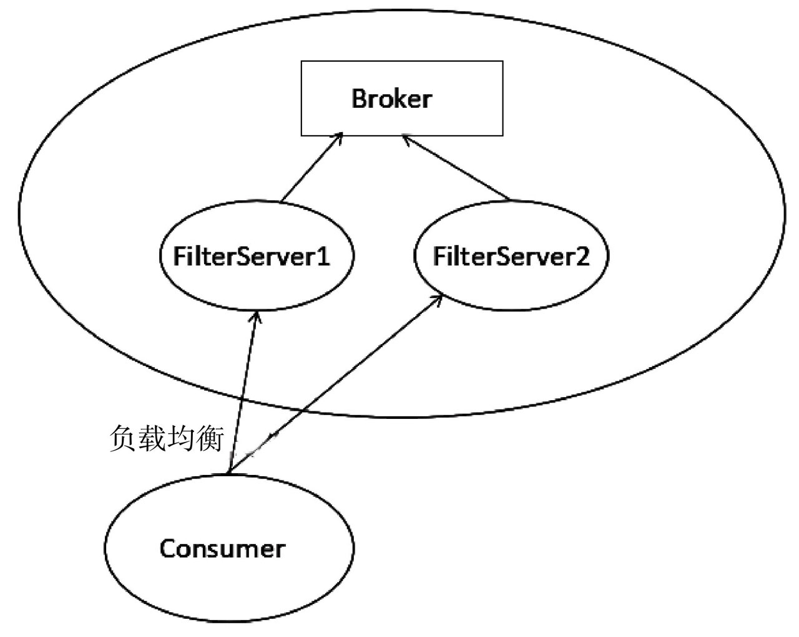

#消息过滤FilterServer

在消息消费的时候，我们会考虑到各种情况，并不是所有消息都需要进行消费的，需要查询出包含特殊标志的消息进行消费，而本章主要分析RocketMQ基于类模式的消息过滤机制，主要内容如下。

##6.1 ClassFilter运行机制

RocketMQ提供了基于表达式与基于类模式两种过滤模式，在第5章已经详细介绍了整个消息拉取、基于表达式（TAG）的过滤模式。基于类模式过滤是指在Broker端运行1个或多个消息过滤服务器（FilterServer）, RocketMQ允许消息消费者自定义消息过滤实现类并将其代码上传到FilterServer上，消息消费者向FilterServer拉取消息，FilterServer将消息消费者的拉取命令转发到Broker，然后对返回的消息执行消息过滤逻辑，最终将消息返回给消费端，其工作原理如图6-1所示。

FilterServer工作原理图

* 1）Broker进程所在的服务器会启动多个FilterServer进程。
* 2）消费者在订阅消息主题时会上传一个自定义的消息过滤实现类，FilterServer加载并实例化。
* 3）消息消费者（Consume）向FilterServer发送消息拉取请求，FilterServer接收到消息消费者消息拉取请求后，FilterServer将消息拉取请求转发给Broker, Broker返回消息后在FilterServer端执行消息过滤逻辑，然后返回符合订阅信息的消息给消息消费者进行消费。

通常消息消费者是直接向Broker订阅主题然后从Broker上拉取消息，类模式的一个特别之处在于消息消费者是从FilterServer拉取消息，那消息消费者是如何感知FilterServer的呢？带着该疑问，让我们开始RocketMQ类模式消息过滤的学习。

##6.2 FilterServer注册剖析

FilterServer在启动时会创建一个定时调度任务，每隔10s向Broker注册自己，请参考代码清单6-1。

**代码清单6-1 `FiltersrvController#initialize`**

那么NameServer中关于Broker的filterServer信息是如何从消息服务器（Broker）传输到NameServer的呢？答案是通过Broker与NameServer的心跳包来实现。

**代码清单6-7 `BrokerOuterAPI#registerBrokerAll`**

Broker每30s向所有NameServer发送心跳包，心跳包中包含了集群名称、Broker名称、Broker地址、BrokerId、haServer地址、topic配置、过滤服务器列表等。

FilterServer在启动时向Broker注册自己，在Broker端维护该Broker的FilterServer信息，并定时监控FilterServer的状态，然后Broker通过与所有NameServer的心跳包向NameServer注册Broker上存储的FilterServer列表，指引消息消费者正确从FilterServer上拉取消息。

##6.3 类过滤模式订阅机制

RocketMQ通过`DefaultMQPushConsumerImpl#subscribe`（String topic, String fullClassName, String filterClassSource）方法来实现基于类模式的消息过滤，其参数分别代表消费组订阅的消息主题、类过滤全路径名、类过滤源代码字符串。

见源码注释 `MQClientInstance#sendHeartbeatToAllBrokerWithLock`，`MQClientInstance#uploadFilterClassToAllFilterServer`，`FilterClassManager#registerFilterClass
`，`FilterClassManager#start`，`HttpFilterClassFetchMethod#fetch`，`HttpFilterClassFetchMethod#fetchClassFromRemoteHost`

##6.4 消息拉取

RocketMQ消息的过滤发生在消息消费的时候，PullMessageService线程默认从Broker上拉取消息，执行相关的过滤逻辑，在FilterServer过滤模式下，PullMessageService线程是如何将拉取地址由原来的Broker地址转换成FilterServer地址呢？

代码清单6-18 `PullAPIWrapper#pullKernelImpl`

##6.5 本章小结

本章详细介绍了RocketMQ另一种消息过滤模式：允许消息消费者在订阅主题消息时上传消息过滤类到过滤服务器，在过滤服务器将消息过滤后再返回给消息消费者，其相比基于TAG模式进行消息过滤有如下优势。
* 1）基于TAG模式消息过滤，由于在消息服务端进行消息过滤是匹配消息TAG的hashcode，导致服务端过滤并不十分准确，从服务端返回的消息最终并不一定是消息消费者订阅的消息，造成网络带宽的浪费，而基于类模式的消息过滤所有的过滤操作全部在FilterServer端进行。
* 2）由于FilterServer与Broker运行在同一台机器上，消息的传输是通过本地回环通信，不会浪费Broker端的网络资源

